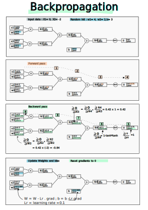

Un réseau de neurone est expression mathématique :
- On a des données d’entrée (inputs),
- une matrice dont on essaie de calculer les valeurs (weights) durant la phase d’entrainement
- et on calcule un résultat : soit une prédiction soit une loss function

Pour  calculer les weigths on essaie de minimiser une fonction "loss function", car plus on minimise, et moins on a d’écart entre le résultat du réseau et le résultat attendu. Le calcul se fait sur des données d’entrées (inputs) qui servent à l’entrainement du modèle.
L’algorithme qui permet itérativement de converger vers ce minimum s’appelle "backpropagation". C’est un algorithme efficace pour évaluer le grandient.

## Forward pass
Étant donné des poids (weights) et des donnés d’entrées (inputs), le cacul de la sortie (output) se fait en faisant une forward pass.
On part des données d’entrées, et on calcule à chaque étape du réseau de neurones les valeurs intermédiaires jusqu’à arriver au résultat final.

## Backpropagation vs Gradient descent
- Gradient descent : algorithme d’optimisation général pour calculer les poids du modèle.
- Backpropagation : c’est une étape de l’algorithme gradient descent, où on met à jour les poids du modèle en calculant des derivées partielles (le gradient) qui donne l’ajustement qu’on donne au poids pour converger vers un minimun.
On part de l’output node, et on remonte le graphe jusqu’aux inputs node. D’où le terme de backpropagation
  
À chaque itération (backpass), on a un ajustement des poids. 
- Soit [W]^n les poids à l’étape n
- Lr : learning rate - un paramètre qui dit à quelle vitesse on veut aller (si c’est trop petit, on converge tout doucement, si c’est trop grand on peut osciller et ne pas trouver le min)
- [G]^n : le gradient - c’est à dire le petit ajusteemnt local des poids qui va permettre au modèle de se rapprocher de l’optimal
 [W]^n+1 = [W]^n - Lr * [G]^n

 Exemple manuel:
 - Inputs : a , b ,c,f
 - Opérations : e  = a * b ; d = e + c ; d * f = L
 - Résultat : L

    a --|
        | (*) --> e --| 
    b --|             | (+) --> d --|
                c --|             | (*) --> L
                                f --|

On veut connaitre l’effet d’une variation de a sur L. Si on augmente un peu a, est-ce que L augmente ou diminue.
Pour cela on doit calculer la dérivée de L par rapport à a, soit dL/da. Pour y arriver on va calculer les dérivées intermédiaires
- dL/dd puis dL/de puis dL/da 
Effectuons la backpropagation manuelle
# 1
dL/dL = 1 c’est le gradient local. 
Notons la valeur du gradient sous la forme [gradient]
    a --|
        | (*) --> e --| 
    b --|             | (+) --> d --|
                c --|             | (*) --> L [1]
                                f --|

# 2
Comme L = d*f
dL/dd = f
dL/df = d

    a --|
        | (*) --> e --| 
    b --|             | (+) --> d --| [f]
                c --|             | (*) --> L [1]
                                f --| [d]

# 3
dL/de = dL/dd * dd/de
d = e + c
Sur une addition, cela correspond à faire une fois le gradient précédent
dd/de = 1 * grad[d]

    a --|
        | (*) --> e --| [f] 
    b --|             | (+)    --> d --| [f]
                c --| [f]            | (*) --> L [1]
                                f --| [d]

# 3

    a --| [f*b]
        | (*)      --> e --| [f] 
    b --| [f*a]            | (+)    --> d --| [f]
                    c --| [f]            | (*) --> L [1]
                                        f --| [d]

# Micrograd
Bibliothèque python permenttant d’illustrer et de calculer des gradients
- Encapsulation des valeurs dans des objets Value
- opération +,-,*,/ et puissance (**)
- permet de calculer la backpropagation
- fonction backward() : initie le calcul de backpropagation, on va calculer toutes les dérivées des expressions, qui ont amenées à cette valeur. Ex: si g dépend de a,b,c,d,e,f, avec a et b valeurs d’entrées et c,d,e, et f des valeurs intermédiaires on va pouvoir calculer la dérivée de g par rapport à a et donc savoir comment on doit faire évoluer a pour que g varie dans le "bon sens". Si on veut diminuer g, on saura comment modifier a et b pour diminuer g

Exemple :
Si dg/da = 130 alors une petite augmentation de a correspond à une augmentation avec une pente de 130

# Dérivée
Dans un réseau de neurone on ne cacule pas symboliquement le résulat des dérivés à l’aide d’équations. On a des dizaines de milliers de paramètres, on ne pose pas ces équations.
Mais on peut aussi voir la dérivée, comme la pente locale de la fonction. Cela se calcule numériquement 
- soit la fonction f(x)
- soit h un incrément tendant vers 0
- l’approximation de la dérivée est : (f(x+h) - f(x))/h quand h tend vers 0

## Scalar vs Tensor
Micrograd permet de travailler sur des scalaires (des floats), en production pour des raisons de performances on parallélise les calculs et les bibliothèques telles que pytorch ne prennent pas en entrée des scalaires mais des Tensors. Un Tensor est un vecteur.
Dans Pytorch, un Tensor est un objet qui a des méthodes, une représentation interne et qui a donc un ensemble d’opérations disponibles de façons optimisése.

# Questions
- différence entre un vecteur et un tensor : pourquoi deux noms différents
Un Tensor est un objet de la bibliothèque Pytorch. Il permet de réaliser plus d’opérations qu’un simple vecteur. On peut le convertir, changer sa taille, le multiplier, appliquer une fonction dessus. 

- dans un réseau de neurone, on a les poids qui représentent les valeurs des opérations à effectuer mais où sont stockés les opérations. Ex je veux passer du layer 3 à 4. Et je dois faire 3x-7. Où est stocké cette équation ?
Si on utilise une bibliothèque comme pytorch, et qu’on passe par des tensors, ceux-ci modélisent la structure complète du graph des opérations.
Si T1 = log(T2*T3 + T4), alors quand on utilise la fonction 
T1.backward(), pytorch "sait" que pour cela il faut calculer les dérivées de log (T2*T3 + T4)
- à quoi sert la "forward pass" vs la "backward pass" dans le gradient descent
Le forward pass sert à caculer la valeur de sortie du réseau et en particulier à calculer la fonction loss qu’on cherche à optimiser
La backward pass sert à ajuster la valeur des poids du réseau en se servant du gradient. Via le gradiant on sait quels poids doivent être augmentés et lesquels doivent être diminuer afin de faire diminuer la fonction de perte (loss)

# Image
Infographie :

