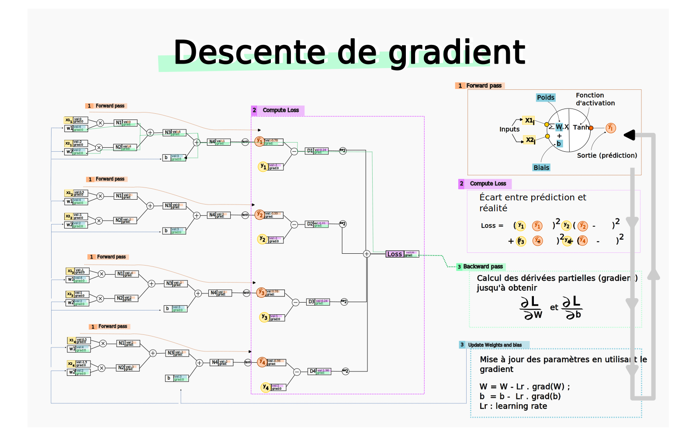
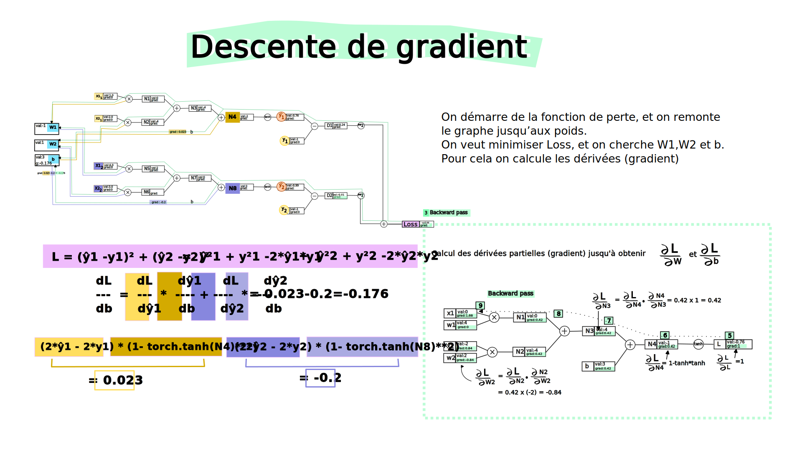

# Backpropagation - Descente de gradient

[](images/gradient-descent.svg)

Un réseau de neurone peut être vu comme une expression mathématique :
- On a des données d’entrée (inputs) sous forme de vecteurs (appelés Tensor)
- une matrice dont on essaie de calculer les valeurs (poids ou weights) durant la phase d’entrainement
- et on calcule un résultat : cela peut être la prédiction d'une valeur numérique par notre réseau

Dans le cas où notre réseau essaie de prédire une valeur, il nous faut une métrique qu'on peut suivre et qui va nous permettre d'évaluer la pertinence de notre modèle. Cette métrique est mesurée par la fonction de perte.
Pour  calculer les poids (weigths) on essaie de minimiser une fonction "loss function", car plus on minimise, et moins on a d’écart entre le résultat du réseau et le résultat attendu. Le calcul se fait sur des données d’entrées (inputs) qui servent à l’entrainement du modèle.
L’algorithme qui permet itérativement de converger vers ce minimum s’appelle "la descente de gradient". 

On a 4 étapes:
1. Passage avant (forward pass)
2. Évaluation de la fonction de perte (loss function)
3. Rétropropagation (backward pass)
4. Mise à jour du réseau

## Forward pass
Lors du **passage avant**, les données d'entrée traversent le réseau pour générer des prédictions. Chaque neurone calcule une sortie en appliquant une fonction d'activation à la somme pondérée de ses entrées. La sortie de la dernière couche est ensuite comparée aux valeurs cibles à l'aide de la fonction de perte.
Étant donné des poids (weights) et des donnés d’entrées (inputs), le cacul de la sortie (output) se fait en faisant une forward pass.
On part des données d’entrées, et on calcule à chaque étape du réseau de neurones les valeurs intermédiaires jusqu’à arriver au résultat final.
On obtient pour chaque jeu de données en entrée [X1,...,Xi] la prédiction ŷi
[](images/forward.svg)

## Loss function
On cherche un indicateur unique nous donnant la précision de notre modèle. La **fonction de perte** mesure l’écart entre les prédictions du modèle et les résultats réels.
On prend comme fonction de perte l'écart entre les valeurs prédites et les valeurs constatées : MSE Mean Square Error
[](images/loss.svg)

## Rétropropagation (backpropagation)
La **rétropropagation** permet de calculer le gradient de la fonction de perte par rapport à chaque poids du réseau. L'idée clé est de propager l’erreur, à partir de la couche de sortie, vers l'entrée, en ajustant les poids à chaque étape.
### Backpropagation vs Gradient descent
- Gradient descent : algorithme d’optimisation général pour calculer les poids du modèle.
- Backpropagation : c’est une étape de l’algorithme gradient descent, où on met à jour les poids du modèle en calculant des derivées partielles (le gradient) qui donne l’ajustement qu’on donne au poids pour converger vers un minimun.
On part de l’output node, et on remonte le graphe jusqu’aux inputs node. D’où le terme de backpropagation
[](images/backward.svg)

À chaque itération (backpass), on a un ajustement des poids. 
- Soit [W]^n les poids à l’étape n
- Lr : learning rate - un paramètre qui dit à quelle vitesse on veut aller (si c’est trop petit, on converge tout doucement, si c’est trop grand on peut osciller et ne pas trouver le min)
- [G]^n : le gradient - c’est à dire le petit ajusteemnt local des poids qui va permettre au modèle de se rapprocher de l’optimal
 [W]^n+1 = [W]^n - Lr * [G]^n

 Exemple manuel:
 - Inputs : a , b ,c,f
 - Opérations : e  = a * b ; d = e + c ; d * f = L
 - Résultat : L
 ```   
    a --|
        | (*) --> e --| 
    b --|             | (+) --> d --|
                  c --|             | (*) --> L
                                f --|
```
On veut connaitre l’effet d’une variation de a sur L. Si on augmente un peu a, est-ce que L augmente ou diminue.
Pour cela on doit calculer la dérivée de L par rapport à a, soit dL/da. Pour y arriver on va calculer les dérivées intermédiaires
- dL/dd 
- puis dL/de 
- puis dL/da 

Effectuons la backpropagation manuelle

### 1
dL/dL = 1 c’est le gradient local. 
Notons la valeur du gradient sous la forme [gradient]

    a --|
        | (*) --> e --| 
    b --|             | (+) --> d --|
                  c --|             | (*) --> L [1]
                                f --|

### 2
Comme L = d*f
dL/dd = f
dL/df = d

    a --|
        | (*) --> e --| 
    b --|             | (+) --> d --| [f]
                  c --|             | (*) --> L [1]
                                f --| [d]

### 3
dL/de = dL/dd * dd/de
d = e + c
Sur une addition, cela correspond à faire une fois le gradient précédent
dd/de = 1 * grad[d]


    a --|
        | (*) --> e --| [f] 
    b --|             | (+)    --> d --| [f]
                  c --| [f]            | (*) --> L [1]
                                   f --| [d]

### 4

    a --| [f*b]
        | (*)      --> e --| [f] 
    b --| [f*a]            | (+)    --> d --| [f]
                       c --| [f]            | (*) --> L [1]
                                        f --| [d]

### Mini-batch
Le mécanisme général est 
1. On utilise 1 jeu de donnée [X],[Y], on fait la forward pass, calcul de la fonction de perte puis backward pass et mise à jour des poids
Pour optimiser on peut aussi, travailler sur un batch de donnée
2. On a par exemple 2 données [X1] [X2]. 
a. On fait en parallèle la forward pass (grâce aux GPU, on parallélise les calculs), 
b. on obtient notre fonction de perte qui est fonction des deux jeux de données, pour une MSE : Loss = (o1-y0)² + (o2 -y1)². Avec o1, o2 les outputs du réseaux, c'est à dire les valeurs prédites.
c. on fait la backward pass, en mettant à jour [W] et b.
d. upgrade des valeurs de [W] et b
La différence entre les méthodes 1 et 2, c'est que la mise à jour du gradient est mutualisée sur un ensemble de jeux de données. On prend un batch de donnée, on calcule le gradient et on mets à jours les poids

### Exemple numérique
Soit un réseau avec un neurone, 2 entrées (et donc un vecteur poids W[w1,w2]) et une fonction d'activation tanh.
Soit X[x1,x2] une vecteur d'input, et y la valeur réelle attendue
Soit o1 = tanh(X@W+b)
n1 = X@W+b -> c'est un scalaire.
    # L = (ŷ -y)² = ŷ² + y² -2*ŷ*y
    # L = (o1 -y)² = o1² + y² -2*o1*y
    # dL/do1 = 2*o1 + 0 -2*y 
    dLdo1 = 2*o1 - 2*y
    

    # Calculons do1 / db
    # g(x): x->tanh(x) // g'(x) = 1 - tanh(x)*tanh(x)
    # o1 = tanh(n1)
    do1db = 1- torch.tanh(n1)**2
    print(f"{fo1b=}")

    # dL/db = dL/o1 * do1/db
    dLdb = dLdo1*do1db
    print(f"Computed gradient: {dLdbitem()=}")

Nouvel exemple avec :
- 2 données d'entrée
- 1 seul neurone
- on va calculer le gradient de W[]
```
    # dL/dw1 = dL/do1 * do1/dw1
    # - dL/do1 = 2*o1- 2*y[0]
    # - do1/dw1 = d(tanh(x1*w1+b))/dw1
    #       g(x) = tanh(ax+b) // g'(x) = a * tanh'(ax+b) = a * (1 - tanh(ax+b)*tanh(ax+b))
    #       a -> x1 = x1[0]
    dLdw11 = (2*o1- 2*y[0])*x1[0]*(1-torch.tanh(n1)**2)
    print(f"{dLdw11=}")

    #print(f"dL/dw12")
    dLdw12 = (2*o1- 2*y[0])*x1[1]*(1-torch.tanh(n1)**2)
    print(f"{dLdw12=}")


    #print(f"dL/dw21")
    dLdw21 = (2*o2- 2*y[1])*x2[0]*(1-torch.tanh(n2)**2)
    print(f"{dLdw21=}")

    #print(f"dL/dw22")
    dLdw22 = (2*o2- 2*y[1])*x2[1]*(1-torch.tanh(n2)**2)
    print(f"{dLdw22=}")
    print(dLdw11+dLdw21)
    print(dLdw12+dLdw22)
    print(f"{w1.grad=}")
```


## Mise à jour des poids

[](images/update.svg)


# Questions
-**Scalar vs Tensor**
On pourrait travailler sur des scalaires (des floats), mais on ne le fait pas en production pour des raisons de performances. On parallélise les calculs et les bibliothèques telles que pytorch ne prennent pas en entrée des scalaires mais des Tensors. Un Tensor est un vecteur.
Dans Pytorch, un Tensor est un objet qui a des méthodes, une représentation interne et qui a donc un ensemble d’opérations disponibles de façons optimisése.
- **différence entre un vecteur et un tensor : pourquoi deux noms différents ?**
Un Tensor est un objet de la bibliothèque Pytorch. Il permet de réaliser plus d’opérations qu’un simple vecteur. On peut le convertir, changer sa taille, le multiplier, appliquer une fonction dessus. 

- **dans un réseau de neurone, on a les poids qui représentent les valeurs des opérations à effectuer mais où sont stockés les opérations. Ex je veux passer du layer 3 à 4. Et je dois faire 3x-7. Où est stocké cette équation ?**
Si on utilise une bibliothèque comme pytorch, et qu’on passe par des tensors, ceux-ci modélisent la structure complète du graph des opérations.
Si T1 = log(T2*T3 + T4), alors quand on utilise la fonction 
T1.backward(), pytorch "sait" que pour cela il faut calculer les dérivées de log (T2*T3 + T4)
- **à quoi sert la "forward pass" vs la "backward pass" dans le gradient descent**
Le forward pass sert à caculer la valeur de sortie du réseau et en particulier à calculer la fonction loss qu’on cherche à optimiser
La backward pass sert à ajuster la valeur des poids du réseau en se servant du gradient. Via le gradiant on sait quels poids doivent être augmentés et lesquels doivent être diminuer afin de faire diminuer la fonction de perte (loss)


