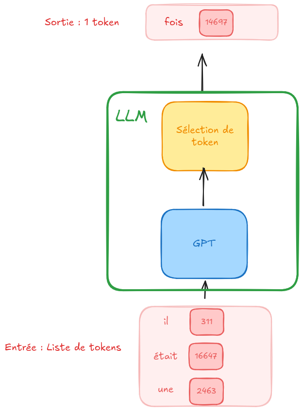
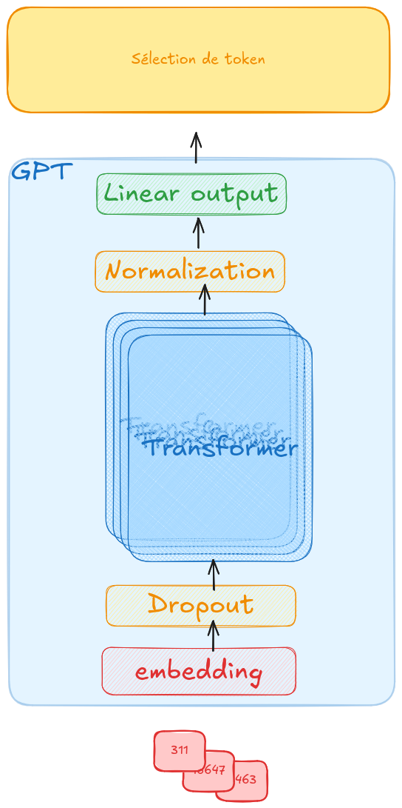
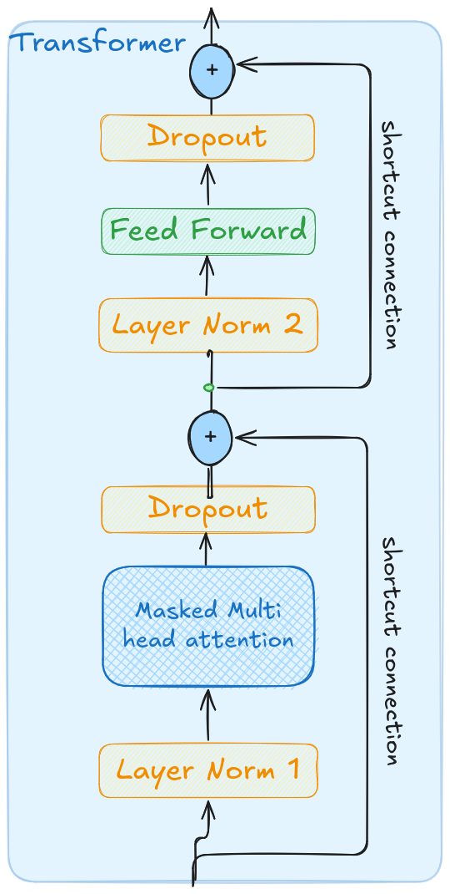
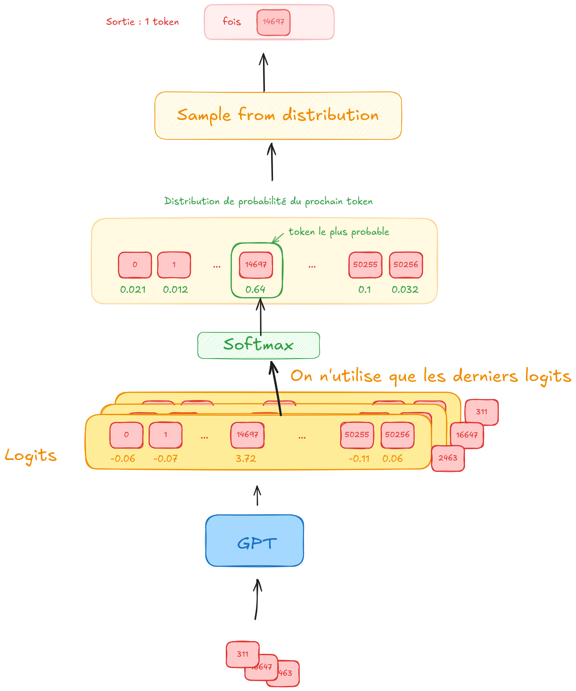
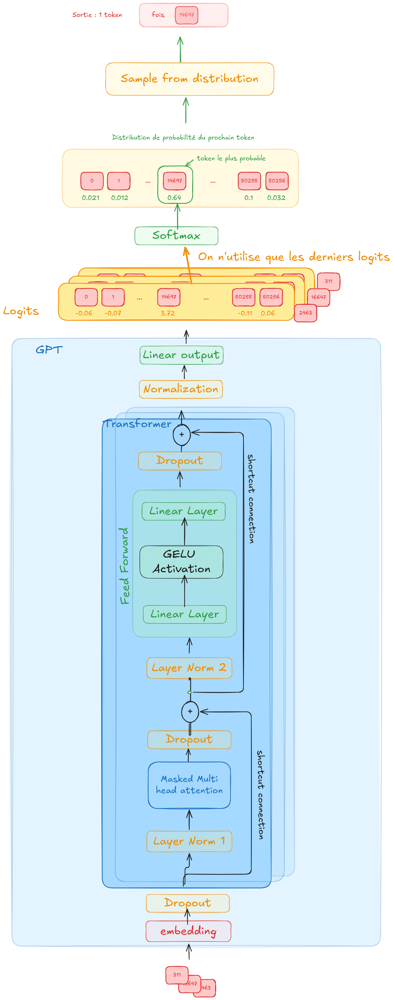

Une fois nos données, collectées, triées et transformées en tokens, on passe à l’étape la plus importante la création d’un Base Model.
C’est cette étape qui est la plus couteuse. On va entrainer un système GPT sur une quantité massive d’informations.
Mais avant de parler de l’entrainement. Qu’est-ce que GPT.

# Entrées et sortie
C’est un système qui prend en entrée des nombres appelés aussi tokens et qui en sortie génère le prochain token
[](images/llm-in-out.png)

# LLM
Si on zoom sur le LLM il peut être décomposé en deux parties :
- GPT : generative pre-trained transformer
- Selection du prochain token
[](images/gpt-select-token.png)

# GPT
Generative Pre-trained Transformer
Il s’agit de l’architecture utilisée par les LLM du marché

[](images/gpt.png)

Regardons de plus près comme on peut implémenter ce modèle en utilisant la librairie `pytorch`
```python
import torch.nn as nn
class GPTModel(nn.Module):
    def __init__(self, config):
        super().__init__()
        self.tok_emb = nn.Embedding(config["vocab_size"], config["embed_dim"])
        self.pos_emb = nn.Embedding(config["context_length"],config["embed_dim"])
        self.drop_emb = nn.Dropout(config["drop_rate"])
        self.trf_blocks = nn.Sequential(*[TransformerBlock(config) for _ in range(config["n_layers"])])
        self.final_norm = LayerNorm(config["embed_dim"])
        self.out_head = nn.Linear(config["embed_dim"], config["vocab_size"],bias=False)

    def forward(self, in_idx):
        batch_size, seq_len = in_idx.shape
        tok_embeds = self.tok_emb(in_idx)
        pos_embeds = self.pos_emb(torch.arange(seq_len, device=in_idx.device))
        x = tok_embeds + pos_embeds
        x = self.drop_emb(x)
        x = self.trf_blocks(x)
        x = self.final_norm(x)
        logits = self.out_head(x)
        return logits
```

Détaillons ligne par ligne:
## Module
`class GPTModel(nn.Module)`
On déclare une classe `class GPTModel(nn.Module)` qui hérite de `torch.nn.Module`. cette héritage va simplifier la gestion du modèle. On peut accéder aux paramètres, on pourra déclencher la backprogagation en une ligne de code, etc...
## Token embedding
`self.tok_emb = nn.Embedding(config["vocab_size"], config["embed_dim"])` On crée un Embedding de taille `(vocab_size, embed_dim)`. C’est la première couche de notre modèle. En entrée on prend des tokens, et en sortie on obtient un embedding de ce token. Ici cet embedding a pour taille `embed_dim`.
Par exemple pour GPT-2, on aurait:
`self.tok_emb = nn.Embedding(50256, 768)` : on a une matrice avec 50256 lignes, et 768 colonnes. On a 50256 tokens possibles, si je veux l’embedding du token 1234, je prends la 1234ème ligne et j’obtiens 768 valeurs qui représentent l’embedding de ce token.
## Position embedding
`self.pos_emb = nn.Embedding(config["context_length"],config["embed_dim"])` On a ici le positional embedding. L’objectif de cette couche est de transmettre l’information sur la position du token dans la phrase. On a `context_length` position possibles, et on va projeter dans l’espace d’embedding de taille `embed_dim`.
Avec GPT-2 `self.pos_emb = nn.Embedding(1024,768)`, on a un contexte de 1024 (nombre maximum de token que le modèle peut prendre en entrée) et donc le token peut être dans une de ce 1024 positions. La sortie sera un vecteur de dimension 768.
## Dropout layer
`self.drop_emb = nn.Dropout(config["drop_rate"])` Les neurones de type dropout, ne servent que durant l’entrainement. L’idée c’est qu’on passe en paramètre un taux (par exemple 10%) et aléatoirement on va désactiver 10% des neurones durant l’entrainement. L’objectif est de forcér le réseau a distribuer ses calculs sur plus de neurones. On veut utiliser le réseau dans son entièreté.
## Transformer block
`self.trf_blocks = nn.Sequential(*[TransformerBlock(config) for _ in range(config["n_layers"])])` Ici on déclare une séquence d’objet TransformerBlock (qu’on va détailler ensuite). Plus précisément on en déclare `n_layers`.
Dans GPT-2 on a 12 layers, on a une série de 12 blocs de Transformers.

### Transformer
Comme son nom l'indique, le composant principal de GPT est le bloc transformer. On a une séquence de blocs transformer qui s'enchainent
[](images/transformer.png)

```python
class TransformerBlock(nn.Module):
    def __init__(self, config):
        super().__init__()
        self.att = MultiHeadAttention(d_in=config["embed_dim"],
                                      d_out=config["embed_dim"],
                                      context_length=config["context_length"],
                                      dropout=config["drop_rate"],
                                      num_heads=config["n_heads"],
                                      qkv_bias=config["qkv_bias"])
        
        self.ff = FeedForward(config)
        self.norm1 = LayerNorm(config["embed_dim"])
        self.norm2 = LayerNorm(config["embed_dim"])
        self.drop_shortcut = nn.Dropout(config["drop_rate"])
```
On a vu qu’on a une séquence de `n_layer` `TransformerBlock`.
un bloc est composé de:
- Multiheadattention
- Une couche feed forward
- deux couches de normalisations
- une couche de dropout

La première étape est une couche de normalisation


## Final normalization layer
`self.final_norm = LayerNorm(config["embed_dim"])` On déclare ici une couche de normalisation de la taille de notre embdedding. L’objectif est de normalisé les valeurs c’est à dire de s’assure qu’on a une moyenne de 0 et une variance de 1.

## Output layer
La dernière couche !
`self.out_head = nn.Linear(config["embed_dim"], config["vocab_size"],bias=False)` on a en entrée un embedding et la sortie est la projection dans notre vocabulaire. On obtient un score appelé `logit` pour chacun des tokens possibles de notre vocabulaire.
Pour GPT-2, on a un vecteur de 50256 valeurs et chaque valuer correspond à un score assigné par le modèle.


### Feed Forward

# Ordonnencemt
On a vu comment toutes ces couches sont déclarées, mais il faut voir comment elles s’interfacent entre elles
```python
class GPTModel(nn.Module):
    def forward(self, in_idx):
        batch_size, seq_len = in_idx.shape
        tok_embeds = self.tok_emb(in_idx)
        pos_embeds = self.pos_emb(torch.arange(seq_len, device=in_idx.device))
        x = tok_embeds + pos_embeds
        x = self.drop_emb(x)
        x = self.trf_blocks(x)
        x = self.final_norm(x)
        logits = self.out_head(x)
        return logits
```
Notre classe hérite de la classe Module de pytorch ce qui nous permet de définir la méthode `forward`.
C’est cette méthode qui va être appelée lors de la forward pass.
En entrée on a un série de tokens. Pour des raisons de performances les tokens sont transmis sous formes de batch.
Plutôt que de transmettre par exemple les tokens `[1,2,3]` puis transmettre les tokens `[4,5,6]` on va transmettre un batch de size 2 qui contient ces deux tensors.
`batch = [[1,2,3],[4,5,6]]`.

`batch_size, seq_len = in_idx.shape` : on déduit de notre séquence de tokens en entrée la taille du batch et la longueur de la séquence. Dans l’exemple ci-dessus on aurait `batch_size=2 `et `seq_len = 3`

`tok_embeds = self.tok_emb(in_idx)` -> on calcule les embeddings associés à chacun des tokens. Avec une taille d’embedding de 768 on aura `[[embedding(1),embedding(2),embedding(3)],[embedding(4),embedding(5),embedding(6)]]`
C’est donc un tensor de taille `[2,3,768]`

`pos_embeds = self.pos_emb(torch.arange(seq_len, device=in_idx.device))` : torch.arange(seq_len), comme a 3 tokens par séquence, cela génère la suite de nombres `[0,1,2]`. Cette suite correspond aux positions des tokens dans la séquence. Puis on va chercher les embeddings de ces positions.
On obtient avec la dimension du batch un tensor de taille `[2,3,768]`
Note : le paramètre `device=in_idx.device` permet de définir sur quel device s’opère le calcul. Par device, on entend le CPU ou le GPU. 

`x = tok_embeds + pos_embeds` : on combine les informations à l’aide d’une simple addition. X contient donc l’information de l’embedding tu token ainsi que l’embedding de sa position.

`x = self.drop_emb(x)` : on drop des neurones aléatoirement.

`x = self.trf_blocks(x)` : on passe notre en série notre tensor d’entrée x dans la séquencede transformer. La sortie du transformer 1 est liée à l’entrée du transformer 2.

`x = self.final_norm(x)` : application d’une couche de normalisation

`logits = self.out_head(x)` : on projète sur notre vocabulaire. On a désormais un tensor de taille `[2,3,50256]`


# Sélection du prochain token
La sortie du bloc gpt est un tensor contenant ce qu'on appelle des logits. Ce sont les scores attribués par le réseau de neurones.
La haute parallélisation de l'architecture des transformers fait que chaque token d'entrée est traité en parallèle. On obtient donc en sortie du bloc GPT `context_length` logits.
Chaque logits est un tensor de dimension `vocab_size`. On a un score associé à chaque token de notre vocabulaire.
Supposons qu'on a 3 tokens en entrée t0, t1 et t2.
Appellons l0, l1 et l2 les logits calculés (en parallèle) pour chacun de ces tokens.
- l0 : représente les scores prédits par le réseau de neurone pour le token qui suivra le token 0, c'est donc les scores du token 1
- l1 : représente les scores prédits par le réseau de neurone pour le token qui suivra le token 1, c'est donc les scores du token 2
- l2 : représente les scores prédits par le réseau de neurone pour le token qui suivra le token 2, c'est donc les scores du token 3
Or nous connaissons déjà les valeurs des tokens 0, 1 et 2 puisque ce sont nos tokens d'entrée. Connaitre les scores de prédictions l0 et l1 ne nous sert à rien.
Ce qui nous intéresse c'est l2, car il contient prédictions pour le token 3.

Note le fait de calculer l0 l1 et l2 alors qu'on ne va utiliser que l2 est intrinsique à l'architecture des transformers :
- tout est calculé en parallèle
- on doit faire tous ces calculs car le mécanisme d'attention a besoin de voir toute la séquence de tokens pour faire sa prédiction

[](images/select-token.png)

À partir des scores (logits) attribués par le réseau à chaque token possible de notre vocabulaire on peut en déduire une probabilité. Pour cela on utilise la fonction `softmax`.
Ensuite, soit on a une stratégie dite `greedy`, qui consiste à choisir systématiquement le token le plus probable (à ce moment là on aurait pu éviter le softmax et prendre juste le token du vocabulaire qui a le score le plus élevé), soit on échantillone à partir de cette distribution pour choisir le prochain token.

```python
def generate_next_token(model, context):
    # context shape: (1, sequence_length)
    # logits shape: (1, sequence_length, vocab_size)
    logits = model(context)
    
    # Get only the last position's predictions
    # last_logits shape: (1, vocab_size)
    last_logits = logits[:, -1, :]
    
    # Apply softmax to convert to probabilities
    probs = F.softmax(last_logits, dim=-1)
    
    # Sample from the probability distribution
    next_token = torch.multinomial(probs, num_samples=1)
    
    return next_token
```

## Échantillonnage
Échantillonner à partir de la distribution veut dire qu'on va tirer aléatoirement le prochain token (ce n'est pas forcément le plus probable qui va être choisi), mais ce n'est pas non plus du hasard. Si un token t0 a probalité de  50%, un autre t1 de 20% et tous les autres sont à moins de 1%, on aura une chance sur deux de tirer t0 et une chance sur cinq de tirer t1

## Logits
Le terme logits est une convention de nommage issue des mathématiques.
En mathématique la fonction logit tire son nom du logarithme:
- c'est la fonction inverse de sigmoid
- logit(p) = log(p/(1-p))
- Cela associe des probabilités (entre 0 et 1) à des nombres dans l'intervale[-∞, +∞]
En deep learning, on n'utilise pas la fonction `sigmoid` car on ne fait une classification binaire. On utilise `softmax`.
Par abus de langage le terme `logits` est utilisé mais cette fois pour representer le score brut donné par le réseau
# Vison globale

[](images/llm-full.png)