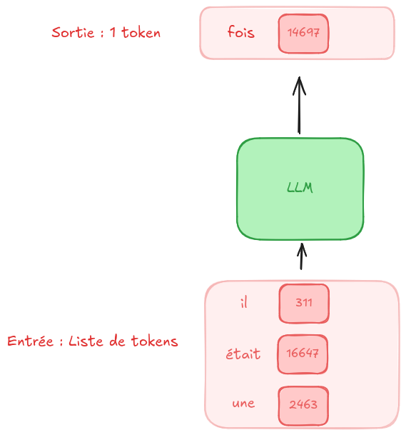

Une fois nos données, collectées, triées et transformées en tokens, on passe à l’étape la plus importante la création d’un Base Model.
C’est cette étape qui est la plus couteuse. On va entrainer un système GPT sur une quantité massive d’informations.
Mais avant de parler de l’entrainement. Qu’est-ce que GPT.
C’est un système qui prend en entrée des nombres appelés aussi tokens et qui en sortie génère un tableau de probabilité.
