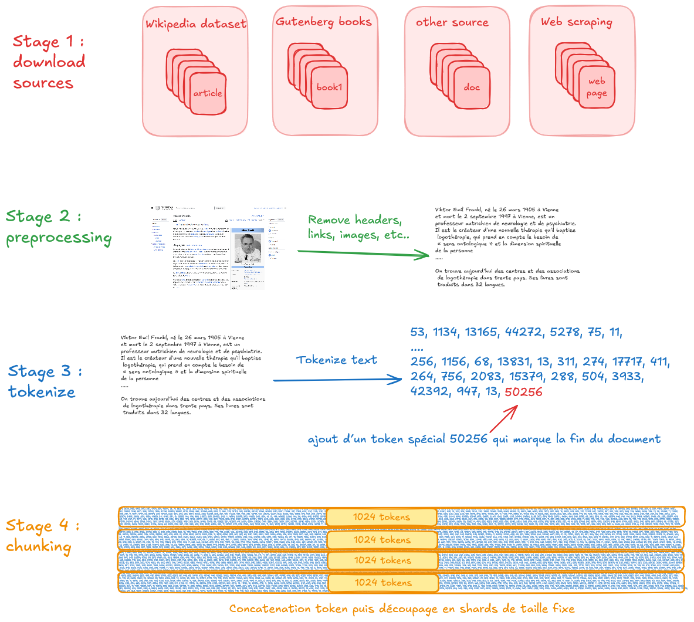

# Data pipeline
Pour créer notre modèle, il nous faut des données, beaucoup de données.
L’objectif de la phase 1 est de créer un dataset composé de tokens.
[](images/data-pipeline.png)

# Hugging Face
Hugging face met à disposition de nombreux datasets.
- se créer un compte
- créer un token d'accès depuis https://huggingface.co/settings/tokens
- installer via pip les modules `huggingface_hub` et `datasets`
- se logguer en ligne de commande `huggingface-cli login`
Puis on peut charger un dataset 
```python
# download french wikipedia dataset from hugging face
from datasets import load_dataset

ds = load_dataset("wikimedia/wikipedia", "20231101.fr")
print(ds["train"][0])
```
Note sous ubuntu les fichiers sont téléchargés dans `/home/USER/.cache/huggingface/`


# Gestion des fins de texte
Référence : https://discuss.huggingface.co/t/how-does-gpt-decide-to-stop-generating-sentences-without-eos-token/41623/10

Dans GPT-2 il n’y a qu’un seul token spécial il s’agit de` <|endoftext|>` qui a pour valeur `50256`.
Il s’agit d’un token qu’on ajoute pour délimiter des documents. Prenons l’exemple d’un dataset d’article wikipedia, à la fin de chaque article on ajoute ce token. Appellons ce token `EOT`.
Dans le modèle, il n’y a aucun traitement spécial de ce token. On pourrait penser qu’on va ajouter un masque d’attention spécifique qui va masquer les tokens suivants le token `EOT`. Il n’en ait rien. C’est le modèle qui va apprendre que quand il y a ce token `EOT`, les tokens précédents ne sont pas necessaires pour prédire le prochain token.

Ce token est un indicateur qui marque le fait qu’on change de contexte, et qu’il ne faut pas regarder les tokens précédents.

# Stratégie de chunking 
Pour pouvoir paralléliser les calculs, notre architecture s’appuie sur la notion de batch où on paralliles X exemples. Si on a un context de `1024` tokens avec un batch de 8, on passe en entrée un tensor `(8,1024)`. Cette taille est fixe, et il faut absolument qu’elle soit respectée. On ne peut pas envoyer une séquence avec moins de tokens par exemples.

On a 2 stratégies :
- Utilisation du EOT 
- Utilisation du Padding

## EOT
À chaque fin de document on ajoute un token spécial `EOT`. La stratégie de chunking est alors très simple, on prend nos données d’entrée par paquets de taille fixe sans s’occuper des tokens dedans. Si on a des séquences de `1024`, on prend `1024` tokens, qui peuvent contenir ou ne pas contenir le token `EOT`.

## Padding
On peut décider que chaque séquence de notre batch représente une entrée différente et un jeu de données spécifiques. 
Mais texte peut être tokenizé en 123 tokens, un deuxième en 555 etc...
Dans cas là pour respecter la contrainte de 1024, on rajoute un token spécial de padding `PAD` pour arriver à la longueur de notre contexte.
- *Avantage* : c’est l’approche la plus naturelle, le LLM voit des séquences qui font du sens ensemble ce qui permet de mieux appréander le contexte, car chaque sample est vu séparément.
- *Inconvénient* : l’entrainement est plus lent car on "gache" du calcul a essayer de prédire des tokens `PAD`.

# Pytorch dataset et dataloader
Le module pytorch propose un modèle pour modéliser les données et les charger :
- `Dataset` : classe générique dont on va hériter et qui représente notre jeu de données
- `DataLoader` : classe qui permet de créer des batchs : sous-ensemble du jeu de données qui vont nous servir lors d'une boucle d'entrainement.

Pour utiliser ces deux classe il faut les importer: `from torch.utils.data import Dataset, DataLoader`
Notre sous-classe héritant de Dataset a 3 méthodes
- `__init__ `: chargement des données
- ` __len__ `: retourne la longueur totale de notre Dataset
- `__getitem__` (idx): étant donné un index retour un tuple (X,Y) avec X données d'entrées, et Y ground truth

```python
class GPTDatasetV1(Dataset):
    def __init__(self, text, tokenizer, max_length, stride):
        """Create a Sample dataset
        text : input text
        tokenizer : tokenizer object that converts string to tokens
        max_length : number of tokens to use as input
        stride : offset used when iterating over the inputs tokens """
        self.tokenizer = tokenizer
        self.input_ids = []
        self.target_ids = []

        # encode the text with tiktoken
        token_ids = tokenizer.encode(text)

        # split the text into chunks of max_length with stride stride
        for i in range(0, len(token_ids) - max_length, stride):
            input_chunk = token_ids[i:i+max_length]
            target_chunk = token_ids[i+1:i+max_length+1]
            self.input_ids.append(torch.tensor(input_chunk))
            self.target_ids.append(torch.tensor(target_chunk))
        self.enc_text = token_ids


    def __len__(self):
        return len(self.input_ids)

    def __getitem__(self, idx):
        return self.input_ids[idx], self.target_ids[idx]
```

Le fait de redéfinir len et getitem permet de créer un itérateur sur notre dataset. On peut itérer séquentiellement sans charger toute nos données.
```python
def create_dataloader_v1(text, batch_size=8, max_length=8,stride=8, 
                         shuffle=True,drop_last=True, num_workers=0):
    """Create a dataloader from a text file
    text : the content of the file
    batch_size : how many elements per batch
    max_length : how many tokens per inputs (the context length)
    stride : how we iterate on the tokens
    shuffle: should we shuffle the inputs
    drop_last : drop last batch if we don't have enough tokens
    num_workers : number of parallel processes to launch
    """
    tokenizer = tiktoken.get_encoding("gpt2")
    dataset = GPTDatasetV1(text, tokenizer, max_length,stride)
    dataloader = DataLoader(dataset, batch_size=batch_size, shuffle=shuffle,
                            drop_last=drop_last, num_workers=num_workers)
    return dataloader
```

On peut ensuite itérer sur le dataloader.
```python
dataloader = create_dataloader_v1(text)
data_iter = iter(dataloader)
first_batch = next(data_iter)
second_batch = next(data_iter)
# we can also use a loop
for i, batch in enumerate(dataloader):
    x, y = batch
```

# EPOCH
Une epoch correspond à l'utilisation de l'ensemble des données à notre disposition pour réaliser l'entrainement.
On a réalisé une `epoch`, quand dans l'entrainement, on a fait le cycle forward pass, loss, backward sur toutes nos données d'entrainements.
Habituellement, un entrainement est composé de plusieurs epochs. On peut réaliser ce cycle 40 fois par exemple. 
Une implémentation naïve serait de prendre toutes nos données, faire une forward pass, calculer la loss function, accumuler le gradient et ne mettre les poids à jour qu'une fois toutes les données d'entrainements vues.
Dans la pratique cette approche n'est pas performante.

# BATCH
Lors de l'entrainement d'un LLM, on prend une phrase, on la transforme en tokens et on entraine le modèle à essayer de prédire le token suivant.
En supposant que :
  - un mot = un token
  - texte = "il était une fois un prince"
Alors 
```
    il --> était
    il était --> une
    il était une --> fois
    il était une fois --> un
    il était une fois un --> prince
```
On pourrait prendre ses paires` [input tokens] --> predicted_token`, les utiliser une à une lors de l'entrainement, mais cela ne serait pas efficace.
Dans la pratique on crée des batchs de X jeux de données, et on va en parallèle les charger, faire la forward pass, calculer la fonction de perte, et faire la backward pass.
La taille optimale d'un batch dépend de la mémoire disponible sur le GPU. Mais en simplifiant, tant qu'on peut charger la mémoire du GPU en augmentant la taille du batch il faut le faire car le temps de traitement du batch et donc de X jeu de données est constant et le même que pour une unique entrée.
 
# Dataset en français
## Reddit
https://www.kaggle.com/datasets/breandan/french-reddit-discussion/data

## Allociné
a new dataset for sentiment analysis, scraped from Allociné.fr user reviews. It contains 100k positive and 100k negative reviews divided into 3 balanced splits: train (160k reviews), val (20k) and test (20k)
https://github.com/TheophileBlard/french-sentiment-analysis-with-bert

## PIAF
PIAFv1.2 contient 9225 pairs des questions/réponses. Il s'agit d'un fichier type JSON.
https://www.data.gouv.fr/fr/datasets/piaf-le-dataset-francophone-de-questions-reponses/

## FSQUAD

https://fquad.illuin.tech/
Questions / réponses en français.

{
    "license": "CC-BY-NC-SA-3.0",
    "company": "ILLUIN Technology",
    "contact": "contact@illuin.tech",
    "version": 1.0,
    "data": [
        {
            "paragraphs": [
                {
                    "qas": [
                        {
                            "question": "Quel astronome a émit l'idée en premier d'une planète entre les orbites de Mars et Jupiter ?",
                            "id": "9f38825f-1bd3-4171-9d3b-b0c2c71e7de2",
                            "answers": [
                                {
                                    "text": "Johann Elert Bode",
                                    "answer_start": 136
                                }
                            ]
                        },
                        {
                            "question": "Quel astronome découvrit Uranus ?",
                            "id": "c2415641-9a62-4052-b57b-9a239da7599c",
                            "answers": [
                                {
                                    "text": "William Herschel",
                                    "answer_start": 404
                                }
                            ]
                        }
                    ]
                    "context": "L'idée selon laquelle une planète inconnue pourrait exister entre les orbites de Mars et Jupiter fut proposée pour la première fois par Johann Elert Bode en 1768. Ses suggestions étaient basées sur la loi de Titius-Bode, une théorie désormais obsolète proposée par Johann Daniel Titius en 1766,. Selon cette loi, le demi-grand axe de cette planète aurait été d'environ 2,8 ua. La découverte d'Uranus par William Herschel en 1781 accrut la confiance dans la loi de Titius-Bode et, en 1800, vingt-quatre astronomes expérimentés combinèrent leurs efforts et entreprirent une recherche méthodique de la planète proposée,. Le groupe était dirigé par Franz Xaver von Zach. Bien qu'ils n'aient pas découvert Cérès, ils trouvèrent néanmoins plusieurs autres astéroïdes."
                }
            ]
        }
    ]
}

