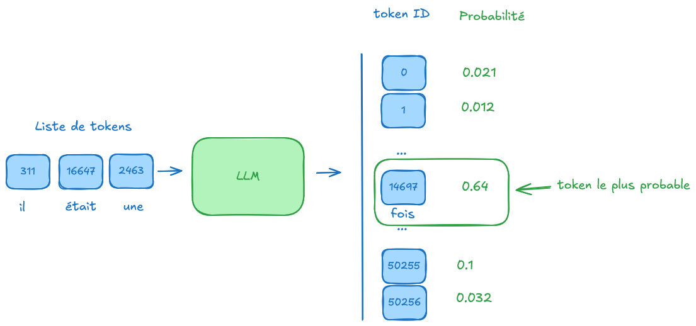

# Pourquoi faire du reinforcement learning
L’objectif de cette phase est d’aligner les réponses du modèle sur ce qu’on veut qu’il produise. Si on ne veut pas qu’il génère des grossièretés, on va `aligné` le modèle vers nos valeurs, ce qu’on veut qu’il produise.

# Concepts
## LLM
Un Large Language Model est un système qui prend en entrée des tokens et génère en sortie une distribution de probabilités sur le token suivant.
[](images/llm-token-probs.png)

## Reinforcement learning
On a un agent (`agent`) qui effectue des actions (`action`) pour maximiser une récompense (`reward`).
Le choix de l’action dépend uniquement de l’état du système (`state`). 
Pour faire ce choix, le sytème utilise une police (`policy`) qui donne les probabilités des actions à effectuer en fonction de l’état actuel du système. 
L’objectif dans le RL est : "to select a policy which maximizes the expected return when the agent acts according to it."
Expected return s’obtient en calculant sur toutes les trajectoires quand l’agent suit la policy.
Se calcule en intégrant sur l’ensemble des trajectoires I[ P(t|pi)R(t) ]
- trajectoire : série d’états et d’actions 
On utilise des modèles `stochastiques` ce qui veut dire que la prochaine action est donnée par une probabilité. À l’état (
`state`) S0, la `policy` nous donne une probabilité P[A0|S0] d’effectuer l’action A0, la P[A1|S0] d’effectuer l’action A1. Même si la probabilité est inférieure de faire A1, il est posssible que ce choix soit effectué. Suite au choix on arrive dans l’état S1 et on refait.
La succession de ces états et actions constitue une trajectoire.
La probabilité d’une trajectoire se calcule en multipliant les probabilités car les évènements sont indépendants et ne dépendent que de l’état courant.
P[T] = probabilité (état initial) * produit [ probabilité P[Si|Si-1,Ai-1] ]

Le calcul de la récompense se fait en ajoutant les récompenses de chaque état de la trajectoire. Mais on veut encourager les trajets les plus courts. Pour cela, on va introduire un `decay` appelé `gamma` qui pénalise à chaque itération la valeur de la reward à cette étape.
r = sum(g^t*r(t)) avec g < 1

## Policy gradient optimization
On est face à un problème, on doit calculer le gradient en se basant sur une policy. Or pour cela il faudrait en théorie calculer toutes trajectoires possibles -> impossible de parcourir toutes les branches.
Dans la pratique, on va générer un ensemble de trajectoires (sample) et on va calculer la moyenne à partir de notre échantillon.

 
# Reinforcement learning dans le cas d’un LLM
Agent : le modèle
State : le prompt (input tokens)
Action : quel token est choisi pour compléter
Reward model : on va pénaliser les tokens qu’on ne veut pas voir, et favoriser les tokens qu’on veut
Policy : C’est le modèle lui-même. Car le modèle donne les probabilités des prochaines actions possibles étant donné l’état actuel.

Trajectoire = série de states / actions
Trajectoire = série (prompt + next token) = série (input tokens + next token)
S0 = quelle est la capitale de la france ?
A0 = Paris
S1 = quelle est la capitale de la france ? Paris
A1 = est
S2 = quelle est la capitale de la france ? Paris est
A2 = la
S3 = quelle est la capitale de la france ? Paris est la
A4 = capitale.
S4 = quelle est la capitale de la france ? Paris est la capitale.

Policy gradient : on génère une série de textes en jouant sur le top_p et la temperature.
ĝ = somme (logprobs(At|St)*Rt)) 

## Reward model - notation humaine
On peut créer un jeu de données, contenant une série de questions. On augmente la température et on demande au modèle de générer plusieurs réponses.
Puis on demande à un évaluateur humain de donner une note à la réponse.
Le problème de cette approche est que chaque anotateur humain va évaluer différmement les réponses. Si on imagine une note de 0 à 10, on aura beaucoup d’écarts entre plusieurs personnes.

Il est plus simple de demander à un humain de comparer des réponses. Si le LLM génère 2 réponses, l’humain donne sa préférence entre les deux.
Puis on va entrainer un modèle dont l’objectif est de prédire quelle est la réponse qu’a préféré l’humain.
Ce modèle va générer une valeur numérique pour chaque réponse. Son objectif est que la valeur des réponses préférées par les humains soit supérieure que les "mauvaises" réponses.
Reward model
- c’est un autre réseau de neurone différent du LLM
- données : question -> [bonne réponse, mauvaise réponse]
- output : un score numérique pour la paire [question/réponse]

## Reward model - architecture
- On part d’un base modèle
- input : question + réponse
- output : score et pas une distribution de probabilités

[](images/reward-model.png)

Pour créer ce modèle, on part d’un base modèle et on remplace le dernier layer pour qu’il renvoie une unique valeur.
Dans un base model, le dernier layer renvoie des logits, qu’on transforme via un softmax en distribution de probabilités.

## Reward model - entrainement
Pour entrainer notre réseau de neurone on définit une fonction de perte qui cherche à maximiser la `reward`, quand on présente une "bonne réponse" et à l’inverse on veut avoir un faible score si on présente une "mauvaise" réponse.

La fonction de reward est -log(sigmoid(reward(good_response) - reward(mauvaise_réponse)))
Au lieu d'une fonction de perte, on parle de fonction d'objectif car c'est une valeur qu'on veut maximiser et non minimiser.
Si le modèle est performant on aura
 - Si R = reward(good_response) - reward(mauvaise_réponse) positif, donc sigmoid(R) sera entre 0 et 1, et alors - log (sigmoid(R)) sera positif
 - Si R = reward(good_response) - reward(mauvaise_réponse) négatif, donc sigmoid(R) sera entre -1 et 0, et - log (sigmoid(R)) sera négatif

 ```python
 # generate rewards for the "good" answers
rewards_chosen = model (input_ids=inputs["input_ids_chosen"])
# generate rewards for the "bad" answers
rewards_rejected = model(input_ids=inputs["input_ids_rejected"])
loss = -nn.functional.logsimoid(rewards_chosen - rewards_rejected).mean()
 ```

 # Reinforcement learning - algorithme
 1. Créer un réseau de neurone qui défini une policy
 2. Échantilloner des trajectoires et calculer les rewards correspondantes
 3. Utiliser les échantillons pour calculer le gradient
 4. Mise à jour des paramètres en fonction du gradient (gradient ascent ici)
 5. Retour au point 2.

En pratique, dans notre réseau de neurones on va utiliser le dernier output layer pour obtenir pour chaque token généré la logprob de ce token et la reward associée.
En échantillonnant, on a un problème, on augmente la variance, et on n’est psa sûr d’aller dans la direction du gradient. Si on ne choisit pas assez d’échantillons, on risque de partir en erreur. 
