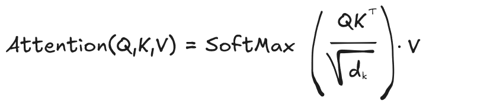

# introduction
L’attention est le mécanisme qui permet à un réseau de neurones de donner du poids, de porter de l’attention à certaines parties de la phrase.
1. "Alice a mangé une pizza et elle était délicieuse"
2. "Alice a mangé une pizza et elle était contente"
Dans la phrase 1 le mot elle fait référence a la pizza, alors que dans la phrase 2, le mot elle fait référence à Alice. Pour transmettre ce type de subtilités on a inventé le concept d’attention. Le mot "elle" va porter attention à "pizza" dans la phrase 1, alors que l’attention portera sur Alice dans la phrase 2

# Self attention
Il s’agit de chercher la simalirité entre chaque mot de la phrase et tous les autres mots (incluant lui-même).
Une fois cette similarité calculée, elle va servir à savoir comment encoder chaque mot.
[](images/attention-formula.png)

Les paramètres sont :
- Q : query
- K : key
- V : value

Ce vocabulaire est issu des bases de données. La `query` est le terme recherché, `key` est la clé de recherche qui est la plus pertinente par rapport à notre terme recherché. Enfin `value` est la valeur retournée par cette recherche.

La formule se décompose comme suit :
- Q.K^t : c’est le produit scalaire entre la query et la key. Cela revient a calculer la proximité entre chaque terme.
- Division par racine carrée (dimension key): c’est pour des raisons de scalabilité. L’algorithme va ainsi converger plus rapidement. C’est une étape de normalisation
- Softmax : cela transforme les valeurs obtenues en pourcentage. On obtient pour chaque token de la phrase le pourcentage d’attention de chacun des autres tokens
- on utilise le pourcentage pour savoir quel poids donner à chaque `value`

## Exemple unitaire simplifié
Prenons un exemple avec une phrase simple contenant 8 tokens et utilisons un embedding de taille 3.
```python
embedding_dim = 3
vocab_size = 50257 # GPT-2 vocab size
input_sentence = "For sale: baby shoes, never worn"

# tokenizer
tokenizer = tiktoken.get_encoding("gpt2")
tokens = tokenizer.encode(input_sentence)
#         For   sale  :    baby  shoes  ,  never  worn
# tokens=[1890, 5466, 25, 5156, 10012, 11, 1239, 12666]
```

Projetons les 8 tokens de notre phrase dans un embedding de taille 3 
```python
# embedding layer
embedding_layer = torch.nn.Embedding(vocab_size, embedding_dim)
print(f"{embedding_layer.weight.shape=}")

input_tokens = torch.tensor(tokens)
inputs_embedding = embedding_layer(input_tokens) # 8x3
print(f"{inputs_embedding.shape=}")
print(f"input_embedding=\n{inputs_embedding.data}")
```

On obtient
```python
embedding_layer.weight.shape=torch.Size([50257, 3])
inputs_embedding.shape=torch.Size([8, 3])
input_embedding=
tensor([[-0.39,  0.48, -0.59],
        [ 1.51, -0.40, -0.86],
        [ 0.87,  0.77, -0.11],
        [ 1.13,  0.76, -0.10],
        [-1.78,  0.51,  0.75],
        [ 0.88, -1.18, -0.93],
        [-1.43,  0.44, -1.14],
        [ 1.01, -0.40, -0.48]])
```

### Calcul de la query
La variable inputs_embedding est de taille 8x3, chaque ligne contient la projection dans l'espace vectoriel de dimension 3 du token.
Nous allons calculer l'attention pour le token correspondant au mot `baby`. C'est le token 5156, qui dans le tensor inputs_embedding est à l'index 3 (le premier token a pour index 0).
```python
# query for the token number 3, which represents the word baby
query_baby = inputs_embedding[3] # 1x3
print(f"{query_baby.data=}")
```
On a la query pour le mot baby qui vaut `tensor([ 1.13,  0.76, -0.10])`.

### Calcul du score d'attention
On va calculer le produit scalaire entre notre query (pour le mot `baby`)et tous les embeddings des tokens de la phrases.
```python
attn_scores_baby = torch.empty(inputs_embedding.shape[0], dtype=torch.float32) # 1x8

for i, input_embedding in enumerate(inputs_embedding):
    attn_scores_baby[i] = torch.dot(query_baby, input_embedding) # attn[i] = dot(1x3,1x3) = scalar
```

Comme on a 8 tokens dans notre phrase, on fait 8 produits scalaires entre l'embedding du mot `baby`et ceux des autres tokens. On stocke le résultat dans un tensor de dimension `1x8`
Cela revient à calculer la similarité entre le mot baby et les autres mots de la phrases :
```attn_scores_baby.data=tensor([-0.02,  1.48,  1.57,  1.85, -1.69,  0.19, -1.16,  0.89])```
Ce score est une valeur brute, on va maintenant transformer ces valeurs en pourcentage. Pour cela on utilise la fonction softmax
```python
attn_weights_baby = torch.nn.functional.softmax(attn_scores_baby, dim=0) # 1x8
print(f"{attn_weights_baby=}")
```
On obtient `attn_weights_baby=tensor([0.05, 0.21, 0.23, 0.31, 0.01, 0.06, 0.02, 0.12]`.
Vis à vis du token 3 associé au mot baby, on peut interpréter ces valeurs comme étant l'importance des autres tokens pour ce token 3.
Le token 0 va influer à 5%, le token 1 à 21% etc...
Dans cet exemple, c'est le token 3 celui du mot baby qui a le plus de poids sur l'attention du mot baby, avec un poids de 31%.

### Calcul du vecteur contexte
Maintenant qu'on a calculé le poids ou l'influence de chaque token vis à vis de notre token 3, on va calculer le vecteur de contexte associé.
```python
context_vector_baby = torch.zeros(embedding_dim, dtype=torch.float32)
print(f"{context_vector_baby.data}")
for i, input_embedding in enumerate(inputs_embedding):
    context_vector_baby += attn_weights_baby[i] * input_embedding
    print(f"{context_vector_baby.data} = {attn_weights_baby[i].data} * {input_embedding.data}")
```
Voici le résultat
```
tensor([0., 0., 0.])
tensor([-0.02,  0.02, -0.03]) = 0.05 * tensor([-0.39,  0.48, -0.59])
tensor([ 0.30, -0.06, -0.21]) = 0.21 * tensor([ 1.51, -0.40, -0.86])
tensor([ 0.51,  0.12, -0.24]) = 0.23 * tensor([ 0.87,  0.77, -0.11])
tensor([ 0.85,  0.35, -0.27]) = 0.31 * tensor([ 1.13,  0.76, -0.10])
tensor([ 0.84,  0.35, -0.26]) = 0.01 * tensor([-1.78,  0.51,  0.75])
tensor([ 0.89,  0.29, -0.31]) = 0.06 * tensor([ 0.88, -1.18, -0.93])
tensor([ 0.87,  0.29, -0.33]) = 0.02 * tensor([-1.43,  0.44, -1.14])
tensor([ 0.99,  0.25, -0.39]) = 0.12 * tensor([ 1.01, -0.40, -0.48])
```

Le résultat final est `tensor([ 0.99,  0.25, -0.39])`. Le `0.99` est obtenu par :
`0.99 = -0.39*0.05 + 1.51*0.21 + 0.87*0.23 + 1.13* 0.31 -1.78*0.01 +0.88*0.06 -1.43*0.02 -0.4* 0.12`
Ce contexte du token 3 (mot baby) est de la dimension de notre espace d'embedding (ici 3). Il peut être interprété comme l'influence de chaque token de la phrase sur ce token spécifique. Pour chaque composante de notre embedding, on va prendre 5% du token 0, 21% du token 2 etc...

## Généralisation
Dans la pratique on n'utilise pas de boucle `for` et on ne calcule pas les `attention weights` et le `context vector` de façon unitaire.
On fait tous ces calculs en parallèle en multipliant des matrices.
```python
attn_scores = torch.matmul(inputs_embedding, inputs_embedding.T) # matmul(8x3, 3x8) -> 8x8
attn_weights = torch.nn.functional.softmax(attn_scores,dim=1) # 8x8
context_vector = torch.matmul(attn_weights, inputs_embedding) # matmul(8x8, 8x3) -> 8x3
```

On obtient tous les vecteurs contextes :
```
tensor([[-0.42,  0.32, -0.55],
        [ 1.17, -0.41, -0.71],
        [ 0.89,  0.27, -0.38],
        [ 0.99,  0.25, -0.39],
        [-1.68,  0.50,  0.50],
        [ 1.05, -0.69, -0.80],
        [-1.29,  0.43, -0.80],
        [ 1.06, -0.34, -0.66]])
```
Et on peut voir que l'index 3 contient le même résulat que celui calculé précedemment.

## Entrainement du modèle
On a effectué un calcul d'attention, mais ce qui a été réalisé doit être réalisé sur nos données d'entrainements et ce qu'on veut c'est que le modèle apprenne quels sont les paramètres à utiliser.
Notre embedding a été initialisé au hasard dans cet exemple.
embedding_layer = torch.nn.Embedding(vocab_size, embedding_dim)
Il faut maintenant arriver à apprendre à partir des données. Pour cela, les paramètres query, key et value seront issus de matrice Q,K et V avec des paramètres entrainables via descente de gradient.


