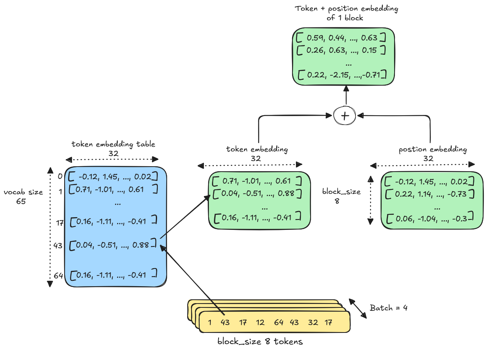
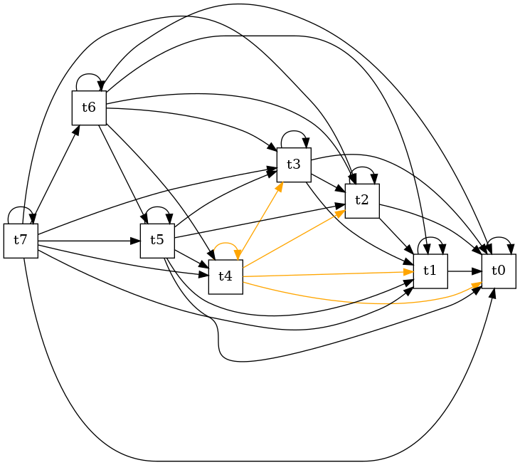

# Traitement par blocs
Les données dans un transformer ne sont pas utilisées dans leur totalité. On doit la partitionner en chunks ou blocs. Typiquement on aura en entrée un maximum de ```block_size``` tokens.
Mais durant l’entrainement on va donner au transformer des entrées allant de 1 à ```block_size``` tokens, pour qu’il ait aussi des entrées avec peu de tokens et qu’il génère quand même une suite probable. Lors de l’inférence on veut pouvoir commencer avec un seul token.

Durant l’entrainement, on a :
- la dimension temporelle, avoir en entrée 1 token, puis 2, puis 3 jusqu’à block_size
- la dimension batch : on va regrouper x exemples ensemble pour optimiser les calculs et paralléliser, et maximiser l’utilisation des GPUs. Les chunks sont traités de façon complètement indépendante.

# batch
On a ```batch_size``` : nombre de séquences qu’on traite en // durant la forward et la backward pass

# Torch
## nn.Embeddings(t,d)
Il s’agit d’une légère surcouche pour faire un tensor de dimension (t,d).
Par défaut les valeurs sont initialisées au hasard
```
self.token_embedding_table = nn.Embedding(vocab_size, vocab_size) # (65,65)

# idx and targets are both (B,T) tensor of integers
# (B,T,C) = (4,8,65)
# B : batch -> nombre d’inputs en parallèle
# T : time -> longueur max du contexte
# C : channels -> dimension de l’embedding
logits = self.token_embedding_table(idx) # (B,T,C) = (4,8,65)
```

explication :
On a l’embedding qui est une matrice 65x65. À chaque ligne (représentant un id de token) est associé le score/prédiction du prochain caractère.
[](images/embedding.png)
## cross entropy
Cette fonction attend les channels dans la deuxième dimension
Il veut une matrice B,C,T
Cela calcule la log likelyhood. Or dans un modèle de bigram à 65 caractères, avec une initialisation au hasard on s’attend à une perte égale à ln(1/65) soit 4.17.

# Bigram  model
On a juste un Embeddings qu’on entraine.

# Transformer
On a nos tokens, et on a layer linéaire pour créer un embedding de ces tokens
## Token embedding
self.token_embedding_table = nn.Embedding(vocab_size, n_embed)
## Postion embedding
self.position_embedding_table = nn.Embedding(block_size, n_embed)
## neurones de sorties
self.lm_head = nn.Linear(n_embed, vocab_size)

# Tête d’attention - mécanisme de sef attention
On a un paramètre qui est la ```head_size = 16```. C’est la taille que l’on donne à notre matrice d’attention.
Dans notre transformer, on a en entrée un matrice x de taille (B,T,C)

- B : taille du batch, combien d’éléments sont traités en parallèle
- T : nombre de tokens du block
- C : nombre de channels par token, correspond à la dimension de l’embedding

Création de deux couches de neurones :
```
key = nn.Linear(C,head_size, bias=False) # (C,16)
query = nn.Linear(C,head_size, bias=False) # (C,16)
```
Pour chaque batch, on calcule deux vecteurs

- k = key(x)
- q = query(y)

On a alors pour k, et q des tenseurs de taille (B, T, 16). On a B tenseurs dans notre batch. Et chaque tenseur a pour taille (T,16).
On commence par calculer leur produit scalaire. Cela donne la proximité entre k et q.
```
wei = q. transpose(k)
```
Puis on fait un masque sur tous les éléments du tensor qui sont dans la diagonale supérieure.
On ne veut pas calculer la relation entre un token, et token d’un indice plus grand, car les tokens ont un ordre et un token de plus grand indice arrive plus tard dans la phrase. Si on calcule son impact/sa relation sur un mot cela revient à dire qu’on connait le mot suivant et donc il est facile de le prédire !
Techniquement on positionne à -infini la valeur car on va appliquer un softmax qui va donc passer cette valeur à 0.
wei = 
La matrice d’attention A se calcule alors par :

- A = softmax(q . transpose(k))

On fait donc `(B, T, 16) @ (B , 16, T) -> (B, T, T)`

Enfin, une fois qu’on connait le poids relatif des tokens les uns par rapport aux autres on peut multiplier par la valeur du token
out = wei @ x # (B, T, T) @ (B, T, C) -> (B,T,C) = (4,8,32)

## Normalisation
On divise le résultat de q.k par racine carrée(head_size).
Si on ne le fait pas, la multiplication va produire de plus grosse valeurs et ces valeurs vont ensuite passer dans une fonction softmax qui va accroitre les écarts. Sans cette normalisation, au fur et à mesure on ne va plus avoir une distribution de probabilité bien diffuse et répartie sur les valeurs, mais on aura plutôt une valeur à 1 et les autres à 0 (cela va tendre vers un vecteur de type one-hot encoding)

Interpretation
x est l’embedding du mot + sa position.
Une fois passé par le mécanisme d’attention, on a un nouvel embedding qui represente le mot + un delta issuu de sa relation avec les autres mots.
Exemple: si on le mot ```avocat```, et que dans la phrase il y a le mot ```assiette```, on peut imaginer que l’embedding du mot va être modifié dans la direction du sens nourriture.
Alors que si on a ce mot avec le mot ```tribunal``` a côté, alors l’embedding vectoriel sera modifié dans le sens de la justice et du droit.


## Decoder - Encoder
On est dans le cas particulier d’une architecture de decoder.

- On masque les tokens futurs car on veut faire de la prédiction
- on utilise uniquement de self-attention.

On parle ici de self-attention, car la tête d’attention a été créée à partir du même ensemble de tokens. C’est le même x qui est donnée en entrée des matrices K, Q et V
    k = key(x)   # (B, T, 16)
    q = query(x) # (B, T, 16)
    v = value(x) # (B, T, 16)

Dans le cas d’un encoder/decoder qui est utilisé par exemple pour de la traduction ou de l’analyse de sentiment :

- On ne va pas masquer les tokens futurs
- on fait de la cross attention. Q va provenir de l’encoder, alors que q et v seront générés par le décoder. On va chercher des informations d’attention sur d’autres noeuds.

## code
```
    torch.manual_seed(1337)
    B,T,C = 4,8,32 # batch, time, channels
    x = torch.randn(B,T,C)
    head_size = 16
    key = nn.Linear(C, head_size, bias=False)
    query = nn.Linear(C, head_size, bias=False)
    value = nn.Linear(C, head_size, bias=False)
    k = key(x)   # (B, T, 16)
    q = query(x) # (B, T, 16)
    v = value(x) # (B, T, 16)
    wei = q @ k.transpose(-2, -1) # (B, T, 16) @ (B, 16, T) = (B, T, T) = (4, 8, 8)

    tril = torch.tril(torch.ones(T, T))
    wei = wei.masked_fill(tril == 0, float("-inf"))
    wei = F.softmax(wei, dim=-1) # (B, T, T) = (4, 8, 8)
    out = wei @ v # (B, T, T) @ (B, T, 16) -> (B,T,16) = (4,8,16)
```

## Matrice d’attention
Un token ne "voit" que les tokens précédents. Dans l’exemple ci-dessous, j’ai mis en couleur Orange ce que voit le ```token 4```. Il ne voit que lui-même ainsi que les tokens 0, 1, 2 et 3.

[](images/token-attention.png)

```
       [[ 0.4516,  0.3215, -3.1926,  0.3077, -0.6161,  0.2563, -0.2989, -2.1917],
        [-0.4001, -0.9621,  1.9568,  0.6661, -0.3263,  0.2626, -1.3973, -0.8945],
        [-0.4620,  0.5860, -4.6738, -0.3218,  1.2684, -0.1740,  1.2461, -2.2283],
        [-0.7175, -1.0279, -2.0509, -2.7234,  0.3123, -0.1642,  1.5162, -0.7767],
        [-0.4039,  0.5160, -2.0697, -0.4098, -0.8053,  0.5221, -0.4124,  1.3377],
        [ 0.8232,  3.0237, -3.0655,  0.7040,  0.6721, -0.4669,  2.3746,  0.3118],
        [-1.4141, -1.4241, -0.8039, -1.7450, -0.7403,  0.9819, -0.9006, -2.3158],
        [-0.5028,  1.6844, -0.4185,  1.0239,  1.0275,  0.1398,  0.4882,  1.5573]]


       [[ 0.4516,    -inf,    -inf,    -inf,    -inf,    -inf,    -inf,    -inf],
        [-0.4001, -0.9621,    -inf,    -inf,    -inf,    -inf,    -inf,    -inf],
        [-0.4620,  0.5860, -4.6738,    -inf,    -inf,    -inf,    -inf,    -inf],
        [-0.7175, -1.0279, -2.0509, -2.7234,    -inf,    -inf,    -inf,    -inf],
        [-0.4039,  0.5160, -2.0697, -0.4098, -0.8053,    -inf,    -inf,    -inf],
        [ 0.8232,  3.0237, -3.0655,  0.7040,  0.6721, -0.4669,    -inf,    -inf],
        [-1.4141, -1.4241, -0.8039, -1.7450, -0.7403,  0.9819, -0.9006,    -inf],
        [-0.5028,  1.6844, -0.4185,  1.0239,  1.0275,  0.1398,  0.4882,  1.5573]]


       [[1.0000, 0.0000, 0.0000, 0.0000, 0.0000, 0.0000, 0.0000, 0.0000],
        [0.6369, 0.3631, 0.0000, 0.0000, 0.0000, 0.0000, 0.0000, 0.0000],
        [0.2586, 0.7376, 0.0038, 0.0000, 0.0000, 0.0000, 0.0000, 0.0000],
        [0.4692, 0.3440, 0.1237, 0.0631, 0.0000, 0.0000, 0.0000, 0.0000],
        [0.1865, 0.4680, 0.0353, 0.1854, 0.1248, 0.0000, 0.0000, 0.0000],
        [0.0828, 0.7479, 0.0017, 0.0735, 0.0712, 0.0228, 0.0000, 0.0000],
        [0.0522, 0.0517, 0.0961, 0.0375, 0.1024, 0.5730, 0.0872, 0.0000],
        [0.0306, 0.2728, 0.0333, 0.1409, 0.1414, 0.0582, 0.0825, 0.2402]]
```

# Multihead attention
Dans l’architecture des Transformers, on a plusieurs Attention Head.
Le résultat du multi-head est juste la concatenation des différente Head.
```python     
out = torch.cat([h(x) for h in self.heads], dim=-1)
# project the layer so that we can add it to the residual connection neuron
out = self.proj(out)
```


Comme chaque attention head, est de dimension, ```(B,T,Head_size)``` on projete le résulat via un réseau de neurone feedforward
