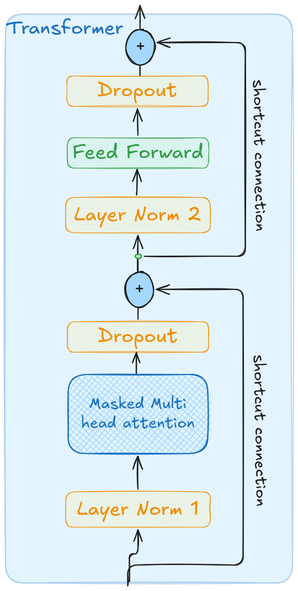
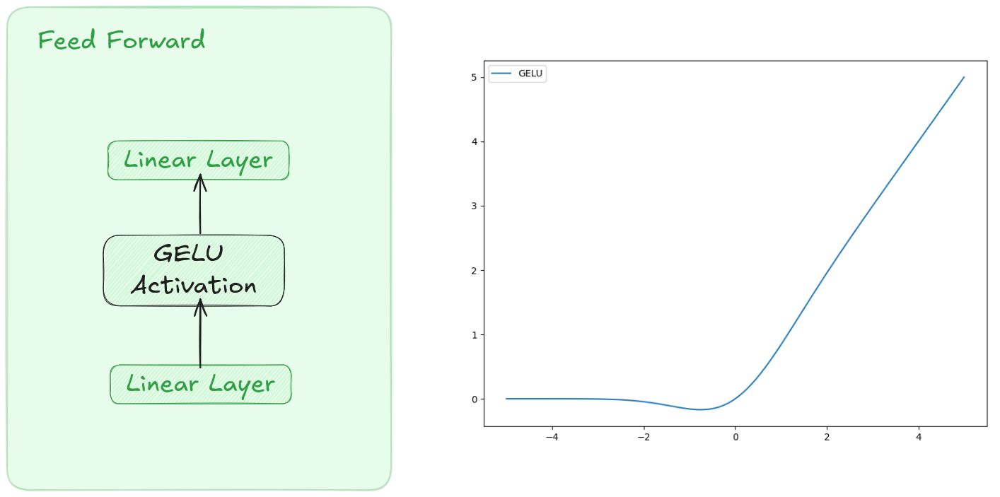

# Transformer
Architecture popularisée en 2017. L’objectif est de pouvoir paralléliser au maximum les opérations.
En entrée, un bloc de transformer prend
- word embedding
- positional encoding


[](images/transformer.png)

# Layer Normalization
Le but de cette couche est normalisé les entrées du transformer, c'est à dire de s'assurer que la moyenne est à 0 et la variance est à 1.
C'est une technique pour assurer la convergence et la stabilité de l'entrainement.
```python
class LayerNorm(nn.Module):
    def __init__(self, emb_dim, eps=1e-5):
        super().__init__()
        self.scale = nn.Parameter(torch.ones(emb_dim))
        self.shift = nn.Parameter(torch.zeros(emb_dim))
        self.eps = eps

    def forward(self, x):
        mean = x.mean(dim=-1, keepdim=True)
        var = x.var(dim=-1, keepdim=True, unbiased=False)
        norm_x = (x - mean) / torch.sqrt(var + self.eps)
        return norm_x * self.scale + self.shift
```

On entrée cette couche prend un tensor de dimension `emb_dim` qui est l'embedding dimension de nos entrées. Cette valeur est de 768 pour GPT-2.

On a scale et shift qui sont deux paramètres entrainables de même dimension que l'input que le LLM va ajuster et permettre que la normalisation fluctue. Le réseau va pouvoir apprendre à partir des données et dans certains cas vouloir que la valeur soit plus grande que 1 par exemple. Si on n'avait pas un réseau au aurait toujours une distribution normale.

# Feed Forward
Il s'agit d'un petit réseau de neurones, entrainable par le réseau, composé de 3 couches :
- linear layer
- GELU
- linear layer

[](images/feed-forward.png)


En entrée on a un tensor e dimension `emb_dim` qui est l'embedding dimension de nos entrées. Cette valeur est de 768 pour GPT-2.
Puis la première couche, multiplie le nombre de paramètres par 4, on passe par la fonction d'activation, et on revient dans la dimension initiale.
Avec GPT-2, cela donne
- linear layer : 768 -> 3072
- GELU : 3072 -> 3072
- linear layer : 3072 -> 768
```python
class FeedForward(nn.Module):
    def __init__(self, config):
        super().__init__()
        self.layers = nn.Sequential(
            nn.Linear(config["embed_dim"], 4 * config["embed_dim"]),
            GELU(),
            nn.Linear(4 * config["embed_dim"], config["embed_dim"]),
        )

    def forward(self, x):
        return self.layers(x)
```
Avec cette couche on étend la dimensionnalité en projetant dans un espace 4 fois plus grand. Cela permet au réseau de chercher de nouvelles relations, d'explorer un espace plus riche.
Par contre, pour pouvoir rendre le modèle plus scalable et pouvoir empiler plusieurs blocs de transformers on revient à la dimension intiale.

# Shortcut connections
Il s'agit d'ajouter notre tensor d'entrée à la sortie de l'`attention` et à la sortie du `FeedForward`. Cela permet de lutter contre un phénomène qu'on appelle le diminshing gradient.
Si on n'utilise pas de shortcut, ce qu'on constate c'est que la valeur absolue du gradient ne fait que diminuer au fur et à mesure qu'on s'enfonce dans les couches du réseau de neurone.
```python
class TransformerBlock(nn.Module):
    def __init__(self, config):
        super().__init__()
        self.att = MultiHeadAttention(d_in=config["embed_dim"],
                                      d_out=config["embed_dim"],
                                      context_length=config["context_length"],
                                      dropout=config["drop_rate"],
                                      num_heads=config["n_heads"],
                                      qkv_bias=config["qkv_bias"])
        
        self.ff = FeedForward(config)
        self.norm1 = LayerNorm(config["embed_dim"])
        self.norm2 = LayerNorm(config["embed_dim"])
        self.drop_shortcut = nn.Dropout(config["drop_rate"])

    def forward(self, x):
        # attention block
        shortcut = x
        x = self.norm1(x)
        x = self.att(x)
        x = self.drop_shortcut(x)
        x = x + shortcut

        # feed forward
        shortcut = x
        x = self.norm2(x)
        x = self.ff(x)
        x = self.drop_shortcut(x)
        x = x + shortcut
        return x
```

# Encoder/decoder
Dans `attention is all you need`, l’archictecture proposée est un modèle transformer encoder/decoder appliqué au cas d’usage de la traduction.
Le premier bloc l’encoder a pour but de créer une représentation riche des entrées. La sortie de l’encoder est un embedding.
La seconde partie est celle qui génère des tokens.
Il existe des modèles qui sont encoder-only comme par exemple BERT.
Puis on a eu l’architecture GPT qui est un modèle decoder only.

## token -> embedding -> attention
Token : faire correspondre un identifiant à un bout de texte. Numériser notre entrée textuelle
Embedding : projeter dans un espcae vectoriel riche un token. Pouvoir représenter des nuances
Attention : trouver les relations entre les tokens dans la phrase entre des éléments. Certains sont liés. "i walked near the bank" vs "i robbed a bank"
bank -> dépend du contexte.
Tout est dynamique, on calcule les relations entre tous les tokens.
prompt = article wikipedia napoleon + question (quand est-il né)
Le mécanisme d’attention va calculer la relation entre les tokens de la question et les tokens de l’article. Et trouver quels sont les tokens importants par rapport à cette quesiton.

## alternative
Flash attention : mécanisme d’attention optimisé en tereme de mémoire.
SSM
Mamba

# self-attention vs cross attention
Dans une architecture encoder/ decoder on parle de cross attention. Le score d'attention de l'encodere est passé en paramètre du décoder.
Dans GPT qui est une architecture decoder only, on parle de self attention.

# Multi-head attention
Chaque tête d'attention prend en entrée l'ensemble des tokens d'input, mais la dimension de l'embedding est répartie entre les têtes d'attention.
Par exemple
- vocab_size = 50256 nombre de tokens dans notre vocabulaire
- embedding_size = 768 dimesion de l'input embedding.
- d_model = 512 c'est la dimension de notre attention
- n_head = 4 : c'est notre nombre de têtes d'attention
- seq_length = 6 : nombre de tokens qu'on trait dans la séquence

Il faut absolument que d_model soit divisible par n_head, car c'est comme cela qu'est découpée la matrice d'embedding d'attention.
Pour chaque matrice Q (c'est pareil pour K,V )
- on aura comme dimension Q (6,512)
- Q est la fusion de Q1,Q2,Q3,Q4 avec chacune de taille (6,512/4) = (6,128)