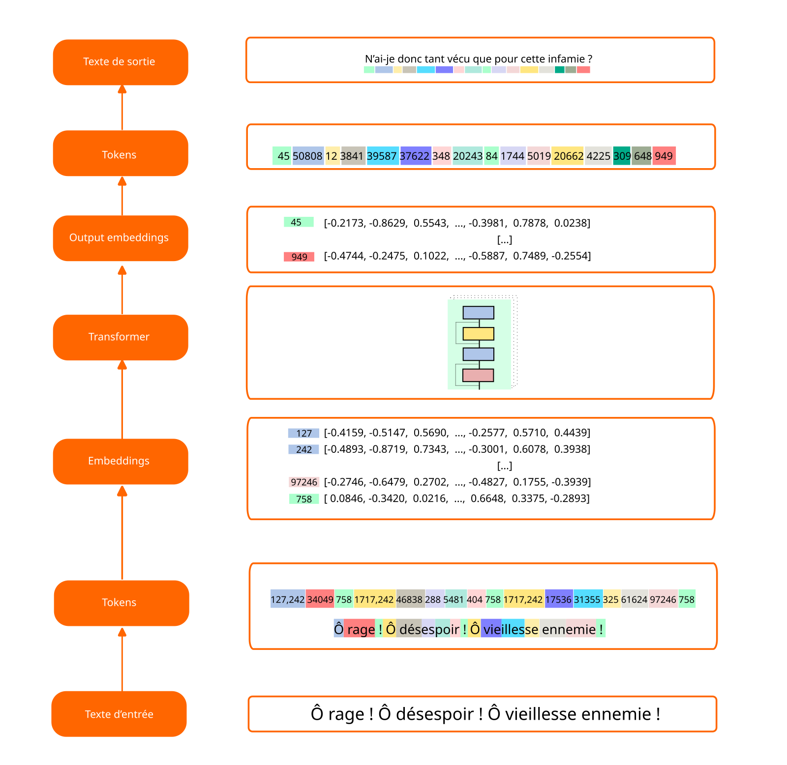
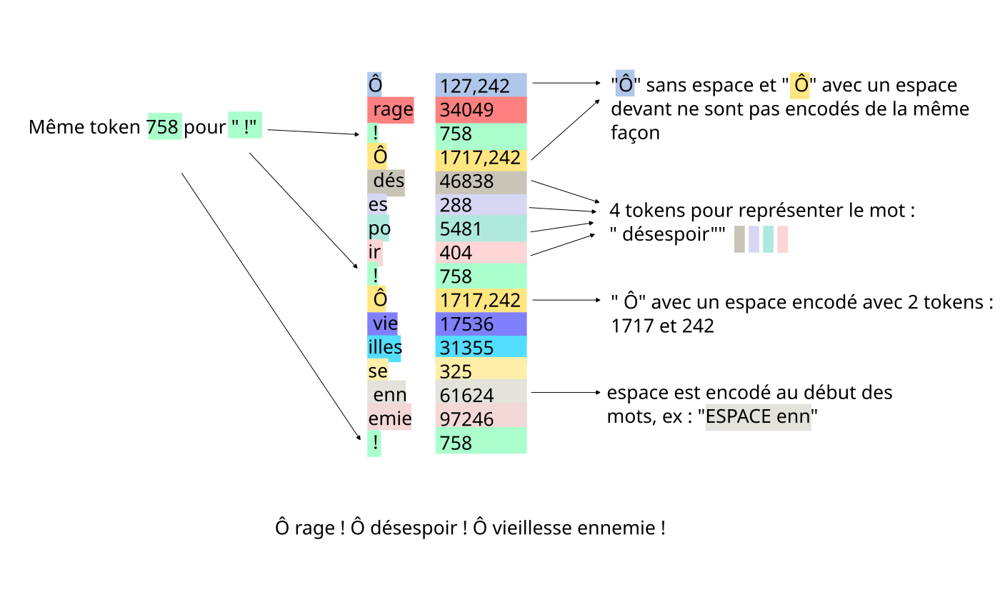

# Objectif
Étant donné un texte d'entrée, on veut le représenter par une sequence numérique.
Un tokenizer a 2 fonctions
- l'encodeur ```tokenizer.encode(str) -> list(int)```
- le décodeur ```tokenizer.decode(list(int)) -> str```

Exemple avec le tokenizer d’Openai qui s’appelle ```tiktoken```.
```python
text = "hello123!!!? (안녕하세요!) 😉"

# tiktoken
import tiktoken
# use GPT-4 encoder
enc = tiktoken.get_encoding("cl100k_base")
print(enc.encode(text))
# [15339, 4513, 12340, 30, 320, 31495, 230, 75265, 243, 92245, 16715, 57037]

text = "<|endoftext|>hello world"
enc = tiktoken.get_encoding("cl100k_base")
print(enc.encode(text, allowed_special="all"))
# [100257, 15339, 1917]
```

[](./images/LLM-tokens.png)

# Implémentations naïves

## Character level 
On associe à chaque lettre un code.
```
ESPACE -> 32
! -> 33
A -> 65
...
Z -> 90
[ -> 91
...
a -> 97
b -> 98
...


```
Exemple :  ```encode("salut toi !") -> [115, 97, 108, 117, 116, 32, 116, 111, 105, 32, 33]```
Cette implémentation est simple, mais a des limitations:
- il faut définir à l'avance tout notre vocabulaire, il faut tous les caractères spéciaux, mais il faut aussi penser aux autres langues. Les kanjis, les émojis.
- cela revient à encoder l'information lettre par lettre, intuitivement on peut se dire que ce nn'est pas très efficace et qu'on pourrait travailler au niveau des mots. C'est à dire associer à un mot, un code.

## Word level
On associe un code à chaque mot du dictionnaire (on suppose qu'il y en a 30.000)
```
a -> 1
abaca -> 2
abacule -> 3
...
zymotique -> 29.999
zythum -> 30.000
! -> 30.001
, -> 30.002
```
Exemple : ```encode("salut toi !") -> [21458,27551,30001]```

Analyse :
- on doit d'abord traiter le texte, pour le découper en mot : il faut donc gérer les espaces, les tabulations
- on doit avoir un dictionnaire de tous les mots possibles à encoder. Mais alors comment encoder les fautes j'écris ```maiston``` au lieu de ```maison```. Comment gérer les langues qu'on a pas vu (javanais, arabe, ...)

# Byte pair encoding
Il s'agit de l'encodage utilisé dans GPT-4. On peut le tester avec la bibliothèque tiktoken publiée par OpenAI
## Principe
L'encodage fonctionne au niveau de la représentation binaire du texte. Il s'appuie sur l'encodage UTF-8, du texte et va chercher à compresser l'information en cherchant quelles sont les séquences les plus fréquentes.

Étapes :

- pre-processing : séparer le texte en mots
- encoder les mots en tokens
- générer des tokens pour les paires les plus fréquentes

Propriétés :

- On ne veut pas que notre encodage dépende de la ponctuation. Il ne faut pas que les termes ```maison```, ```maison.```, ```maison?``` fassent changer l'encodage du mot ```maison```.
- on veut pouvoir encoder des mots qu’on n’a jamais vu
- on veut pouvoir choisir la taille de notre vocabulaire

[](./images/tokens.png)
### 1/ Pre-processing
On commence par découper le texte d’entrée en mots. Voici les expressions régulières utilisées par GPT2 et GPT4

#### GPT2
```r"""'s|'t|'re|'ve|'m|'ll|'d| ?\p{L}+| ?\p{N}+| ?[^\s\p{L}\p{N}]+|\s+(?!\S)|\s+"""```
- R1 : ``` ?\p{L}+``` : un espace optionnel suivi, d'une ou plusieurs lettres
- R2 : ``` ?\p{N}+``` : un espace optionnel suivi, d'une ou plusieurs chiffres
- R3 : ```'s``` : exactement la chaîne "'s"
- R4 à R9 : idem avec 't 're 'ev 'm 'll et 'd
- R10: ``` ?[^\s\p{L}\p{N}]+```si les règles suivantes ne s'appliquent pas, un espace optionnel suivi un caractère qui n'est pas ni un espace, ni une lettre, ni un chiffre -> la ponctuation
- R11 : ```\s+(?!\S)``` : une série d'espace sans prendre le dernier espace. Utile car dans le reste de la tokenization on a souvent <ESPACE>Token, donc on garde ce dernier espace pour le mot suivant.
- R12 : ```\s+``` : une suite de plusieurs espaces consécutifs, les derniers espaces à la fin de la phrase

#### GPT4
```r"""'(?i:[sdmt]|ll|ve|re)|[^\r\n\p{L}\p{N}]?+\p{L}++|\p{N}{1,3}+| ?[^\s\p{L}\p{N}]++[\r\n]*+|\s++$|\s*[\r\n]|\s+(?!\S)|\s"""```
- ?i: - case insensitive
- \p{N}{1,3}+ : les chiffres sont fusionnés par paquet de 3 maximum

### 2/ Encodage
On part de la représentation de chaque caractère dans l’encodage UTF-8. On a pour un caractère un encodage entre 1 et 4 octets:

    a      U+0061   lettre a    01100001                               91
    [SP]   U+0020   espace      00100000                               20
    é      U+00E9   e accentué  11000011 10101001                      195 169
    ぁ     U+3041   Hiragana    11100011 10000001 10000001             227 129 129 
    😅    U+1F605  smiley      11110000 10011111 10011000 10000101    240 159 152 133

On va prendre un des mots de l’étape 1, et le convertir dans la représentation décimale de son encodage UTF-8.
Le mot ```Maison``` devient ```[77,97,105,115,111,110]```. À ce stade le mot ```Maison``` est représenté par 6 tokens. Et on a chaque token qui est un chiffre entre 0 et 255.
On fait cela pour tous les mots de notre dataset.

### 3/ Appariement et création de token
On va ensuite chercher la paire de chiffre la plus fréquente. Si on suppose que dans notre jeu de données c’est ```le``` -> ```[108,101]```, alors on créer un nouveau token le numéro 256 qui va représenter ```le```.
On a maintenanant un vocabulaire de 257 tokens (0 à 256), on remplace tous les occurrences de la paire ```[108,101]```par ce token ```256```, et on recommence.
Recherche de la paire la plus fréquente, création du token ```257``` et remplacement de cette paire par le nouveau token.
On continue jusqu’à soit qu’il n’y ait plas de paire, soit qu’on ait atteint le vocabulaire max qu’on s’est fixé.

Exemples issus de GPT:
- "ine" est le token 500
- "ice" est le token 501
- "against" est le token 32826
- " against" est le token 1028

Note: Sentence piece, essaie de compenser le fait que deux fois le meme mot avec un espace devant ont un encodage différent en ajoutant un espace au début de la phrase.

### Special tokens
dans GPT2, encoder('<|endoftext|>) = 50256, c'est le dernier token encodé. Il sert à délimiter les documents. Cela permet au modèle d'apprendre qu'il doit repartir à zéro quand il voit ce token
Dans le fine-tuning on utilise aussi des tokens spéciaux comme
```<|im_start|>system<|im_sep|>You are a helpful assistant<|im_end|><|im_start|>user<|im_sep|><|im_end|><|im_start|>assistant<|im_sep|>```
Ici ces tokens servent à séparer les éléments du dialogue:
- im_start : imaginary dialog start

Le traitement de ces tokens est fait dans l'algorithme par des traitements spéciaux. Ce n'est pas BPE qui gère ces cas.
FIM : fill in the middle

Il est possible d'étendre le vocabulaire et de rajouter des specials tokens. 
- dans la librairie tiktoken c'est prévu
- attention cela a un impact sur l'architecture de transformer. Il faut rajouter une ligne dans les embeddings, et rajouter une sortie dans l'output layer car on a un token de plus dans la liste des probabilités

# Impact sur l’architecture du LLM
Le nombre de tokens qu’on a c’est à dire la taille de notre vocabulaire ```vocab_size``` a un impact sur l’architecture du LLM. Si on prend l’exemple de GPT-2, on a un ```vocab_size=50256```
Ce nombre ```50256``` se retrouve dans deux endroits :
- la table d’embedding
- le neurone de sortie
## Embedding table
```token_embedding_table = nn. Embeddding(vocab_size, n_embd) : ```
- 2-dim array. 
- nombre de lignes est notre vocabulaire, chaque token est associé à un vecteur d’embedding qu'on entraine durant la backpropagation,
- n_embd : nbre de channels dans notre transformer

## Neurone de sortie
```lm_head = nn.Linear(n_embd, vocab_size)```
- linear layer
- produce logits
- probability of every single tokens
Le neurone de sortie donne pour chacun des tokens du vocabulaire qu’elle est la probabilité qu’il soit le prochain. 

## Taille du vocabulaire
Plus on a de tokens, plus la représentation du texte est dense. Or il faut considérer le fait que dans l’architecture de transformer on a un contexte qui est de taille fixe. Si on a un contexte de 1024, cela veut dire que le LLM va pouvoir manipuler 1024 tokens à la fois.  
Si on augmente trop le nombre de tokens, par exemple on dit qu'on a un vocab_size = 1 million. 
- Alors dans les données d'entrainement on aura des tokens très rares, et l'entrainement ne pas voir beaucoup de données sur certains tokens ce qui va faire que les embeddings seront sous-entrainé. Les tokens vont être mal représentés dans notre espace vectoriel d’embedding.
- on va compresser énormément d'info dans un seul token (on aura des tokens très longs), et lors de la forward pass on ne va pas bien entrainer le réseau. Le réseau ne pourra pas ajuster les poids de façon optimale

### ajouter un token lors du fine-tuning
On doit créer un embedding initialié au hasard pour ce nouveau token
On doit aussi changer le dernier neurone.
On refait un training avec ces tokens

# Limitations dûes au tokenizer
- spelling : les mots sont transformés en token qui peuvent être très long. Donc le LLM ne sait pas décomposer un mot
- ex dans gpt4 il y a token  .DefaultCellStyle -> c'est vu comme un seul token.
- reverse string. idem si on lui demande de l'épeller à l'envers. Il faut lui dire de décomposer les lettres, et ensuite il a les tokens individuels
- gestion des langues étrangères : il a vu moins d'info dans le training du modèle, mais aussi durant la tokenization où on occupe beaucoup plus de tokens. Hello how are you ? -> 5 tokens, en coréen c'est 15 !
- arithmétique : les chiffres/nombres sont tokenizés très différemment, on peut avoir 123 en 1 token mais 778 c'est 2 tokens. Or l'addition va devoir décomposer les unités, les dizaines, les centaines.
- si on demande de compléter alors qu'on finit notre phrase par un espace, on risque de tomber sur des cas très peu probables. En effet les tokens commencent par un espace. Or l'espace a déjà été mis, le comportement risque d'être assez aléatoire. Même problème si on veut compléter un token très long.
.DefaultCellSty -> vu comme [13578,3683,626,88] il va essayer de trouver un nouveau token alors que la réponse c'est un token unique [86662]
- solidmagickarp : token créé durant le training du tokenizer. Il est apparu suffisament pour avoir son token. Mais si pas de données dans le LLM avec ce token, alors l'embedding associé n'est jamais entrainé et les poids associés restent ceux initialisés au hasard. Le modèle va donc générer n'importe quoi.
