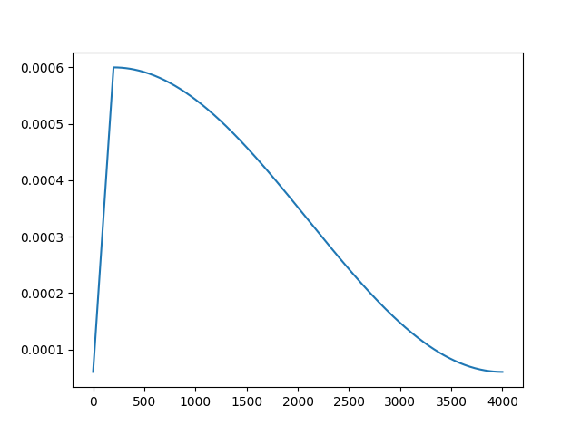

# GPU
Location de GPU
https://app.hyperbolic.xyz/compute

# Learning rate
C'est un hyperparameter. C'est la vitesse à laquelle on fait notre descente de gradient.

On le fait varier tout au long de notre entrainement.

# Weight decay
Technique de régularisation qui limitee l'augmentation de la valeur des poids du modèle. On ne veut pas qu'ils prennent des valeurs trop importantes.
- limite over-fitting : empecher le réseau de reproduire trop parfaitement les données d'entrainement
- meilleure généralisation
- simplification du modèle : cela permet de lisser le modèle, et d'empêcher le modèle de mettre en place des fonctions trop complexe.

La formule

    L_total = L_original + (λ/2) * Σ(w²)

Where:

- L_total is the final loss used for optimization
- L_original is the original loss function (like cross-entropy)
- λ (lambda) is the weight decay coefficient
- Σ(w²) is the sum of squared weights in the network

During gradient descent, this leads to weight updates of the form:

    w_new = w_old - α * (∂L_original/∂w + λw)

Where:

- α is the learning rate
- ∂L_original/∂w is the gradient of the original loss
- λw is the regularization term

The λw term constantly pulls the weights toward zero during training. The strength of this pull is determined by:

- λ (the weight decay coefficient): larger values mean stronger regularization
- The current value of the weight w: larger weights experience stronger decay

This is why it's called "weight decay" - the weights literally decay towards zero unless the training signal is strong enough to counteract this effect. The quadratic nature of the penalty (w²) means it particularly discourages large weight values while having less effect on smaller weights.