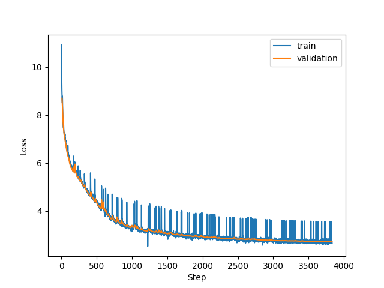

# Training steps
À partir de notre dataset on crée des shards contenant 2^20 tokens.
On va avoir un batch size de taille fixe 524288 (2^19).
Or ce batch size nécessite beaucoup de RAM. On va faire une série de micro batch, accumuler le gradient, et ne mettre à jour les poids que quand on aura atteint la taille voulue de notre batch.
Concrètement, avec une 1070 Ti, on a un 
- micro_batch = 2
- sequence_length = 1024
On aura besoin de faire 2^19/(2*1024) = 2^8 = 256 steps 

# GPU
Location de GPU
https://app.hyperbolic.xyz/compute

# Learning rate
C'est un hyperparameter. C'est la vitesse à laquelle on fait notre descente de gradient.

On le fait varier tout au long de notre entrainement.

# Weight decay
Technique de régularisation qui limitee l'augmentation de la valeur des poids du modèle. On ne veut pas qu'ils prennent des valeurs trop importantes.
- limite over-fitting : empecher le réseau de reproduire trop parfaitement les données d'entrainement
- meilleure généralisation
- simplification du modèle : cela permet de lisser le modèle, et d'empêcher le modèle de mettre en place des fonctions trop complexe.

La formule

    L_total = L_original + (λ/2) * Σ(w²)

Where:

- L_total is the final loss used for optimization
- L_original is the original loss function (like cross-entropy)
- λ (lambda) is the weight decay coefficient
- Σ(w²) is the sum of squared weights in the network

During gradient descent, this leads to weight updates of the form:

    w_new = w_old - α * (∂L_original/∂w + λw)

Where:

- α is the learning rate
- ∂L_original/∂w is the gradient of the original loss
- λw is the regularization term

The λw term constantly pulls the weights toward zero during training. The strength of this pull is determined by:

- λ (the weight decay coefficient): larger values mean stronger regularization
- The current value of the weight w: larger weights experience stronger decay

This is why it's called "weight decay" - the weights literally decay towards zero unless the training signal is strong enough to counteract this effect. The quadratic nature of the penalty (w²) means it particularly discourages large weight values while having less effect on smaller weights.

# Loss
Voici la courbe présentant l’évolution de la fonction de perte calculée sur l’epoch 0. On a passé toutes nos données une fois et on voit qu’à la fois la fonction de perte durant l’entrainement et sur nos données de validation diminue.

# Normalisation
Si dans nos batch d’entrées on a des valeurs qui fluctuent grandement. Par exemple
x1 = [0.7,1, -1.02]
et x2 = [71, 34,-55]
on aura grand changement en input -> grand changement dans la valeur de sortie -> grand changement dans le calcul de la loss function -> grand changement dans le calcul du gradient -> grande fluctuation dans la mise à jour des poids.
Pour que le modèles convergent plus rapidement on applique de la normalisation. Sinon l’apprentissage va osciller et le processus sera plus lent.
Supponsons qu’on a un modèle de classificatino d’images : cat, dog, zebra, tree etc..

La normalisation consiste à avoir une moyenne de 0 et une variance de 1.

## batch normalization
On normalise colonne par colonne.
Le problème c’est qu’on mélange la dimension 1 d’un chat avec celle d’un chien etc...
Pour que cela fasse du sens on a besoin d’avoir de très grand batch permettant de mixer toutes les catégories afin que la valeur soit pertinente

## layer normalization
Cela revient à normaliser sur les lignes, on prend tous les features d’un chat et c’est ça qu’on normalise.
On peut donc avoir dans un même batch des images complètement différentes et cela n’aura pas d’impact.