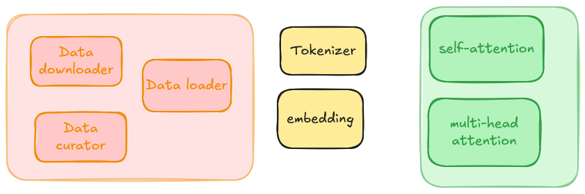

# LLM from scratch
La construction d’un LLM se fait en plusieurs étapes

- collecte des données: téléchargement, suppression des doublons, nettoyages des caractères
- data loader : découpage des données en batch qui peuvent être traités
- tokenization : mise en place d’une tokenizer pour transformer le texte en tokens
- embedding : embedding des tokens dans un espace vectoriel
- attention : mécanisme d’attention pour ajouter du contexte aux embeddings de mots

## Download and preprocess
Exemple de données fineweb
On a un filtre sur les urls qu’on veut analyser
On doit ensuite récupérer le texte et pas le html
On filtre sur la langue
PII removal : personal information and identification removal

## tokenization
Les LLM necessitent de travailler sur des séquences de nombres. 
Si on prend l’encodage en bits on se retrouve avec une liste de symboles possibles de deux éléménts (zéro et un), et des séquences très longues.
On utiles BPE byte paire encoding pour construire un vocabulaire de la taille que l’on veut. Aujourd’hui on a GPT-3 qui avait 50.000 symboles, et GPT-4 100.277

## data ingestion
On a nos données d’entrées, sous formes de tokens. On va prendre des bouts aléatoires (des chunks), qui auront entre 0 et X tokens. Le X est un choix de design. On peut imposer 4k tokens, 8k tokens etc...
C’est avant tout une limite technique, plus le contexte est important plus on a besoin de RAM
